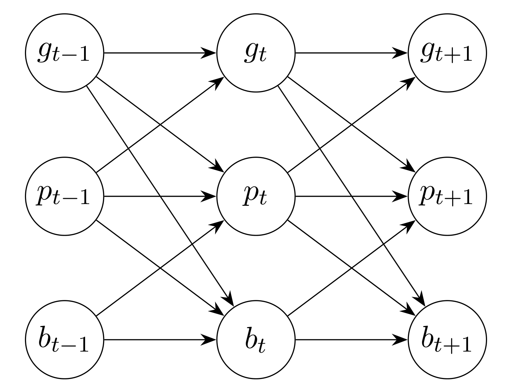
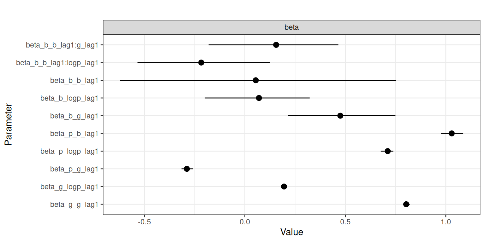
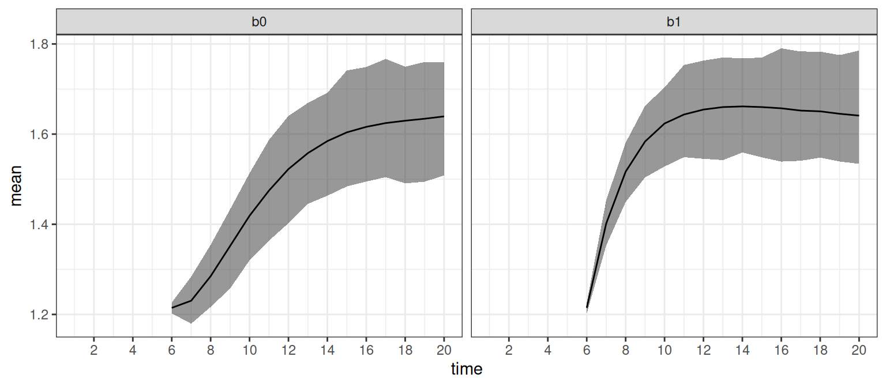
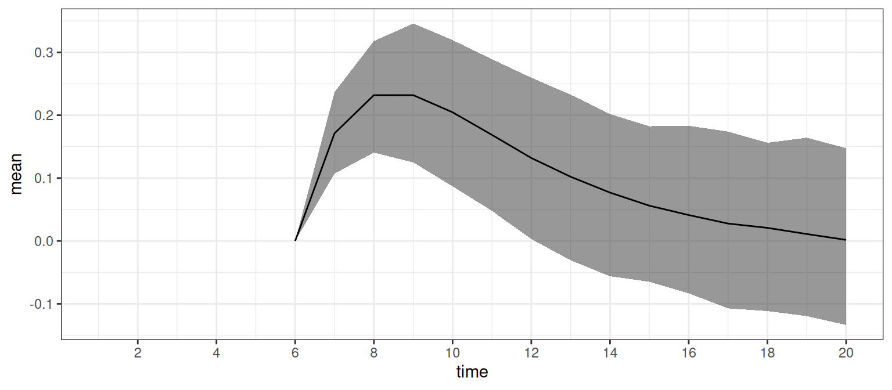
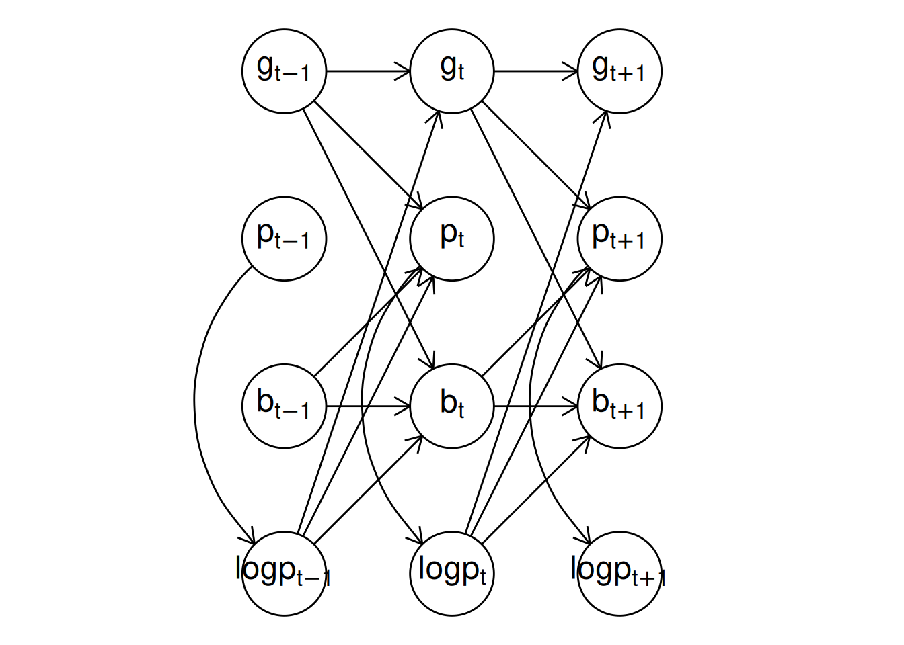
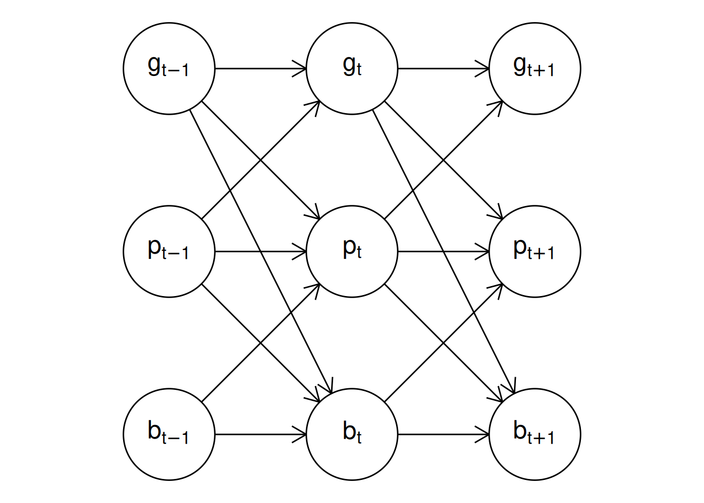
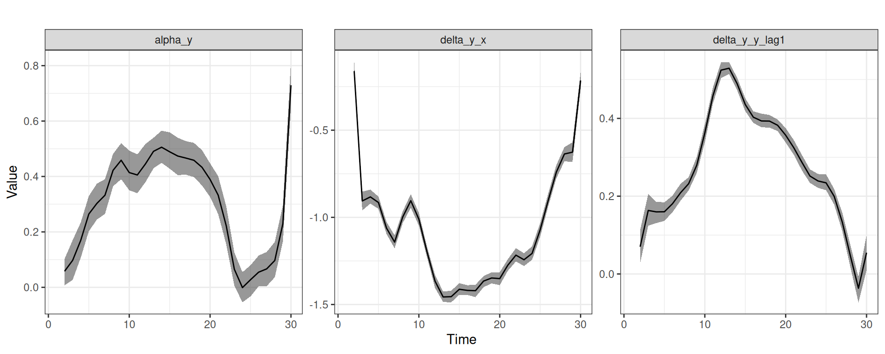
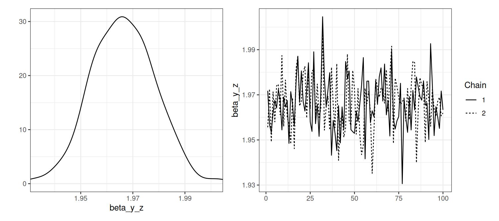
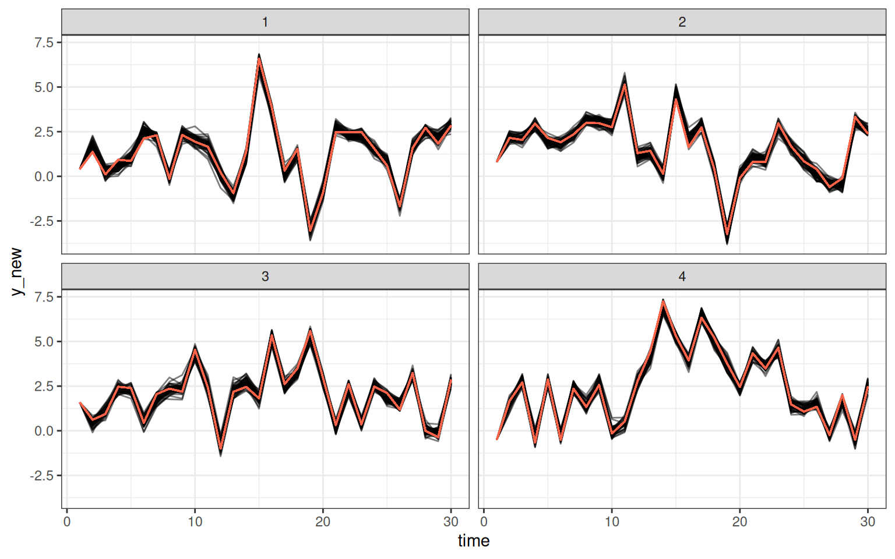

# dynamite: An R Package for Dynamic Multivariate Panel Models

**dynamite** is an R package for Bayesian inference of intensive panel
(time series) data comprising multiple measurements per multiple
individuals measured in time. The package supports joint modeling of
multiple response variables, time-varying and time-invariant effects, a
wide range of discrete and continuous distributions, group-specific
random effects, latent factors, and customization of prior distributions
of the model parameters. Models in the package are defined via a
user-friendly formula interface, and estimation of the posterior
distribution of the model parameters takes advantage of state-of-the-art
Markov chain Monte Carlo methods. The package enables efficient
computation of both individual-level and aggregated predictions and
offers a comprehensive suite of tools for visualization and model
diagnostics. This vignette is a modification of ([Tikka and Helske
2024a](#ref-dynamite)).

## 1 Introduction

Panel data is common in various fields such as social sciences. These
data consist of multiple individuals followed over several time points,
and there are often many observations per individual at each time, for
example, family status and income of each individual at each time point
of interest. Such data can be analyzed in various ways, depending on the
research questions and the characteristics of the data such as the
number of individuals and time points, and the assumed distribution of
the response variables. In social sciences, popular, somewhat
overlapping modeling approaches include dynamic panel models, fixed
effect models, dynamic structural equation models ([Asparouhov et al.
2018](#ref-Asparouhov2018)), cross-lagged panel models (CLPM), and their
various extensions such as CLPM with fixed or random effects ([Arellano
and Bond 1991](#ref-arellano1991); [Allison 2009](#ref-Allison2009);
[Bollen and Brand 2010](#ref-Bollen2010); [Allison et al.
2017](#ref-Allison2017); [Hamaker et al. 2015](#ref-Hamaker2015);
[Mulder and Hamaker 2021](#ref-Mulder2021)) and general cross-lagged
panel model ([Zyphur et al. 2020](#ref-Zyphur2020)).

There are several R ([R Core Team 2023](#ref-R)) packages available from
the Comprehensive R Archive Network (CRAN) focusing on the analysis of
panel data. The **plm** package ([Croissant and Millo 2008](#ref-plm))
provides various estimation methods and tests for linear panel data
models, while the **fixest** package ([Bergé 2018](#ref-fixest))
supports multiple fixed effects and different distributions of response
variables. The **panelr** package ([Long 2020](#ref-panelr)) contains
tools for panel data manipulation and estimation methods for so-called
“within-between” models that combine fixed effect and random effect
models. This is done by using **lme4**, **geepack**, and **brms**
packages as a backend ([Bates et al. 2015](#ref-lme4); [Halekoh et al.
2006](#ref-geepack); [Bürkner 2018](#ref-brms)). The **lavaan** package
([Rosseel 2012](#ref-lavaan)) provides methods for general structural
equation modeling (SEM) and thus can be used to estimate various panel
data models such as CLPMs with fixed or random intercepts. Similarly, it
is also possible to use general multilevel modeling packages such as
**lme4** and **brms** directly for panel data modeling. Of these, only
**lavaan** and **brms** support joint modeling of multiple
interdependent response variables, which is typically necessary for
multi-step predictions and long-term causal effect estimation ([Helske
and Tikka 2024](#ref-dmpm)).

In traditional panel data models such as the ones supported by the
aforementioned packages, the number of time points considered is often
assumed to be relatively small, say less than 10, while the number of
individuals can be hundreds or thousands ([Wooldridge
2010](#ref-Wooldridge2010)). This is especially true for commonly used
“wide format” SEM approaches that are unable to consider a large number
of time points ([Asparouhov et al. 2018](#ref-Asparouhov2018)). Perhaps
due to the small number of time points, the effects of covariates are
typically assumed to be time-invariant, although some extensions to
time-varying effects have emerged (e.g., [Sun et al.
2009](#ref-Sun2009); [Asparouhov et al. 2018](#ref-Asparouhov2018);
[Hayakawa and Hou 2019](#ref-hayakawa2019)). On the other hand, when the
number of time points is moderate or large, say hundreds or thousands
(sometimes referred to as intensive longitudinal data), it can be
reasonable to assume that the dynamics of the system change over time,
for example in the form of time-varying effects.

Modeling time-varying effects in (generalized) linear models can be
based on state-space models (SSMs, [Harvey and Phillips
1982](#ref-harvey1982); [Durbin and Koopman 2012](#ref-durbin2012);
[Helske 2022](#ref-helske2022)), for which there are various R
implementations such as **walker** ([Helske 2022](#ref-helske2022)),
**shrinkTVP** ([Knaus et al. 2021](#ref-knaus2021)), and
**CausalImpact** ([Brodersen et al. 2014](#ref-brodersen2014)). However,
these implementations are restricted to a non-panel setting of a single
individual and a single response variable. Other approaches include
methods based on varying coefficients models ([Hastie and Tibshirani
1993](#ref-hastie1993); [Eubank et al. 2004](#ref-eubank2004)),
implemented in **tvReg** and **tvem** packages ([Casas and
Fernández-Casal 2022](#ref-casas2022); [Dziak et al.
2021](#ref-dziak2021)). While **tvem** supports multiple individuals, it
does not support multiple response variables per individual. The
**tvReg** package supports only univariate single-individual responses.
Also based on SSMs and differential equations, the **dynr** package ([Ou
et al. 2019](#ref-dynr)) provides methods for modeling multivariate
dynamic regime-switching models with linear or non-linear latent
dynamics and linear-Gaussian observations. Because both multilevel
models and SEMs can be defined as SSMs (see e.g., [Sallas and Harville
1981](#ref-Sallas1981); [Helske 2017](#ref-KFAS); [Chow et al.
2010](#ref-Chow2010)), other packages supporting general SSMs could be
suitable for panel data analysis in principle as well, such as **KFAS**
([Helske 2017](#ref-KFAS)), **bssm** ([Helske and Vihola
2021](#ref-bssm)), and **pomp** ([King et al. 2016](#ref-pomp)).
However, SSMs are often computationally demanding especially for
non-Gaussian observations where the marginal likelihood is analytically
intractable, and a large number of individuals can be problematic,
particularly in the presence of additional group-level random effects
which complicates the construction of the corresponding state space
model ([Helske 2017](#ref-KFAS)).

The **dynamite** package ([Tikka and Helske
2024b](#ref-dynamitepackage)) provides an alternative approach to panel
data inference which avoids some of the limitations and drawbacks of the
aforementioned methods. First, the dynamic multivariate panel data
models (DMPMs), introduced by Helske and Tikka ([2024](#ref-dmpm)) and
implemented in the **dynamite** package support estimation of effects
that vary smoothly over time according to Bayesian P-splines ([Lang and
Brezger 2004](#ref-lang2004)), with penalization based on random walk
priors. This allows modeling for example the effects of interventions
that increase or decrease over time. Second, **dynamite** supports a
wide variety of distributions for the response variables such as
Gaussian, Poisson, binomial, and categorical distributions. Third, with
**dynamite**, we can model an arbitrary number of simultaneous
measurements per individual. Finally, the estimation is fully Bayesian
using Markov chain Monte Carlo (MCMC) simulation via Stan ([Stan
Development Team 2024b](#ref-Stan)) leading to transparent and
interpretable quantification of parameter and predictive uncertainty. A
comprehensive comparison between DMPMs and other panel data modeling
approaches can be found in ([Helske and Tikka 2024](#ref-dmpm)).

One of the most defining features of **dynamite** is its
high-performance prediction functionality, which is fully automated,
supports multi-step predictions over the entire observed time interval,
and can operate at the individual level or group level. This is in stark
contrast to packages such as **brms** where, in the presence of lagged
response variables as covariates, obtaining such predictions
necessitates the computation of manual stepwise predictions and can pose
a challenge even for an experienced user. Furthermore, by jointly
modeling all endogenous variables simultaneously, **dynamite** allows us
to consider the long-term effects of interventions that take into
account the interdependence of the variables in the model.

The paper is organized as follows. In [Section 2](#sec-model) we
introduce the dynamic multivariate panel model which is the class of
models considered in the **dynamite** package and describe the
assumptions made in the package with respect to these models.
[Section 3](#sec-dynamitepackage) introduces the software package and
its core features along with two illustrative examples using a real
dataset and a synthetic dataset. [Section 4](#sec-construction),
[Section 5](#sec-fitting) provide a more comprehensive and technical
overview of how to define and estimate models using the package. The use
of the model fit objects for prediction is discussed in
[Section 6](#sec-prediction). Finally, [Section 7](#sec-summary)
summarizes our contributions and provides some concluding remarks.

## 2 The dynamic multivariate panel model

Consider an individual i at time t with observations y\_{t,i} =
(y\_{1,t,i},\ldots, y\_{C,t,i}), t=1,\ldots,T, i = 1,\ldots,N. In other
words, at each time point t we have C observations from N individuals,
where C is the number of different response variables that have been
measured. The response variables can be univariate or multivariate. We
assume that each element of y\_{t,i} can depend on the past observations
y\_{t-\ell,i}, \ell=1,\ldots, t-1 (where the set of past values can be
different for each response) and also on additional exogenous covariates
x\_{t,i}. In addition, each response variable y\_{c,t,i} can depend on
other observations at the same time point t, i.e., the elements of
y\_{t,i}, with the following restriction. We assume that the response
variables can be ordered so that the distribution of y\_{t,i} factorizes
according to an ordering \pi of the responses. We denote the
observations at the same time point before observation y\_{c,t,i} in
this ordering by y\_{\pi(c),t,i}. Thus, the conditional distribution of
response c is completely defined by the observations at the same time
point before the response in the ordering \pi, past observations,
exogenous covariates, and the model parameters for all c = 1,\ldots,C.
For simplicity of the presentation, we now assume that all response
variables are univariate and that the responses only depend on the
previous time points, i.e., \ell = 1 for all response variables. The set
of all model parameters is denoted by \theta. We treat the first L time
points as fixed data, where L is the highest order of lag dependence in
the model. Now, assuming that the elements of y\_{t,i} are conditionally
independent given y\_{t-1,i}, x\_{t,i}, and \theta we have y\_{t,i} \sim
p_t(y\_{t,i} \| y\_{1:t-1,i},x\_{t,i},\theta) = \prod\_{c = 1}^C
p\_{c,t}(y\_{c,t,i} \| y\_{\pi(c),t,i}, y\_{1:t-1,i}, x\_{t,i}, \theta),
\tag{1} where y\_{1:t-1,i} denotes the past values of all response
variables (y\_{1,i},\ldots,y\_{t-1,i}). Importantly, the parameters of
the conditional distributions p\_{c,t} can be time-dependent, enabling
us to consider the evolution of the dynamics of our system over time.

Given a suitable link function depending on our distributional
assumptions, we define a linear predictor \eta\_{c,t,i} for the
conditional distribution p\_{c,t} of each response c with the following
general form: \eta\_{c,t,i} = \alpha\_{c,t} + u^\top\_{c,t,i} \beta_c +
w^\top\_{c,t,i} \delta\_{c,t} + z^\top\_{c,t,i} \nu\_{c,i} +
\lambda^\top\_{c,i} \psi\_{c,t}, \tag{2} where \alpha\_{c,t} is the
(possibly time-varying) common intercept term, u^\top\_{c,t,i} defines
the covariates corresponding to the vector of time-invariant
coefficients \beta_c, and similarly w^\top\_{c,t,i} defines the
covariates for the time-varying coefficients \delta\_{c,t}. The term
z^\top\_{c,t,i} \nu\_{c,i} corresponds to individual-specific random
effects, where \nu\_{1,i},\ldots, \nu\_{C,i} are assumed to follow a
zero-mean Gaussian distribution, either with a diagonal or a full
covariance matrix. Note that the covariates in u^\top\_{c,t,i},
w^\top\_{c,t,i}, and z^\top\_{c,t,i} may contain values of other
response variables at the same time point that appear before response c
in the ordering \pi, past observations of the response variables (or
transformations of them), or exogenous covariates. Covariates in
z^\top\_{c,t,i} can overlap those in u^\top\_{c,t,i} and w^\top\_{c,t,i}
resulting in an interpretation for \nu\_{c,i} that corresponds to
individual-specific deviations from the population-level effects \beta_c
and \delta\_{c,t}, respectively. In contrast, the covariates in
u^\top\_{c,t,i} and w^\top\_{c,t,i} should in general not overlap to
ensure the identifiability of their respective model parameters. The
final term \lambda^\top\_{c,i} \psi\_{c,t} is a product of latent
individual loadings \lambda\_{c,i} and a univariate latent dynamic
factor \psi\_{c,t}. The latent factors can be correlated between
responses.

For the time-varying coefficients \delta\_{c,t} (and similarly for
time-varying \alpha\_{c,t} and the latent factor \psi\_{c,t}), we use
Bayesian P-splines \[penalized B-splines; Eilers and Marx
([1996](#ref-eilers1996)); Lang and Brezger ([2004](#ref-lang2004))\]
such that \delta\_{c,t,k} = b^\top_t \omega\_{c,k}, \quad k=1,\ldots,K,
where K is the number of covariates, b_t is a vector of B-spline basis
function values at time t, and \omega\_{c,k} is a vector of
corresponding spline coefficients. We assume a B-spline basis of equally
spaced knots on the time interval from L+1 to T with D degrees of
freedom. In general, the number of B-splines D used for constructing the
splines for the study period 1,\ldots,T can be chosen freely, but the
actual value is not too important \[as long as D is larger than the
degree of the spline, e.g., three for cubic splines; Wood
([2020](#ref-Wood2020))\]. Therefore, we use the same D basis functions
for all time-varying effects. To mitigate overfitting due to too large a
value of D, we define a random walk prior ([Lang and Brezger
2004](#ref-lang2004)) for \omega\_{c,k} as \omega\_{c,k,1} \sim
p(\omega\_{c,k,1}), \quad \omega\_{c,k,d} \sim N(\omega\_{c,k,d-1},
\tau^2\_{c,k}), \quad d=2, \ldots, D, with a user-defined prior
p(\omega\_{c,k,1}) on the first coefficient, which due to the structure
of b_1 corresponds to a prior on \delta\_{c,k,1}. Here, the parameter
\tau\_{c,k} controls the smoothness of the spline curves. While the
different time-varying coefficients are modeled as independent a~priori,
the latent factors \psi\_{c,t} can be modeled as correlated via
correlated spline coefficients \omega\_{c,k}. See the appendix for
details of the parametrization of the latent factor term.

For categorical, multivariate, and other distributions with multiple
dimensions or components, we can extend the definition of the linear
predictor in [Equation 2](#eq-linpred) to account for each dimension by
simply replacing the index c with indices c,s where s denotes the index
of the dimension, s = 1,\ldots,S(c), and S(c) is the number of
dimensions of response c. This extension also applies to the spline
coefficients.

## 3 The `dynamite` package

The **dynamite** package provides an easy-to-use interface for fitting
DMPMs in R. As the package is part of rOpenSci (<https://ropensci.org>),
it complies with its rigorous software standards and the development
version of **dynamite** can be installed from the R-universe system
(<https://ropensci.org/r-universe/>). The stable version of the package
is available from CRAN at
(<https://cran.r-project.org/package=dynamite>). The software is
published under the GNU general public license (GPL \geq 3) and can be
obtained in R by running the following commands:

``` r

install.packages("dynamite")
library("dynamite")
```

The package takes advantage of several other well-established R
packages. Estimation of the models is carried out by Stan for which both
**rstan** and **cmdstanr** interfaces are available ([Stan Development
Team 2024a](#ref-rstan); [Gabry and Češnovar 2023](#ref-cmdstanr)). More
specifically, the MCMC simulation uses the No-U-Turn sampler (NUTS,
[Hoffman and Gelman 2014](#ref-hoffman2014)) which is an extension of
Hamiltonian Monte Carlo (HMC, [Neal 2011](#ref-Neal2011)). The
**data.table** package ([Barrett et al. 2024](#ref-datatable)) is used
for efficient computation and memory management of predictions and
internal data manipulations. For posterior inference and visualization,
**ggplot2** and **posterior** packages are leveraged ([Wickham
2016](#ref-ggplot2); [Bürkner et al. 2023](#ref-posterior)).
Leave-one-out (LOO) and leave-future-out (LFO) cross-validation methods
are implemented with the help of the **loo** package ([Vehtari et al.
2022](#ref-loo)). All of the aforementioned dependencies are available
on CRAN except for **cmdstanr** whose installation is optional and
needed only if the user wishes to use the **CmdStan** backend for Stan.
Although not required for **dynamite**, we also install the **dplyr**,
**pder**, and **pryr** packages ([Wickham et al. 2023](#ref-dplyr);
[Croissant and Millo 2022](#ref-pder); [Wickham 2023](#ref-pryr)), as we
will use them in the subsequent sections. In addition to the required R
packages, **dynamite** also requires C++ compilation capabilities due to
Stan. Specifically for Windows users, this means that RTools has to be
installed (<https://cran.r-project.org/bin/windows/Rtools/>).

Several example datasets and corresponding model fit objects are
included in **dynamite** which are used throughout this paper for
illustrative purposes. The script files to generate these datasets and
the model fit objects can be found in the package GitHub repository
(https://https://github.com/ropensci/dynamite/) under the `data-raw`
directory. [Table 1](#tbl-dynamitefuns) provides an overview of the
available functions and methods of the package. Before presenting the
technical details, we demonstrate the key features of the package and
the general workflow by performing an illustrative analysis on a real
dataset and a synthetic dataset.

| Function | Output | Description |
|:---|:---|:---|
| [`dynamite()`](https://docs.ropensci.org/dynamite/reference/dynamite.md) | `"dynamitefit"` | Estimate a dynamic multivariate panel model |
| [`dynamice()`](https://docs.ropensci.org/dynamite/reference/dynamice.md) | `"dynamitefit"` | Estimate a DMPM with multiple imputation |
| [`dynamiteformula()`](https://docs.ropensci.org/dynamite/reference/dynamiteformula.md) | `"dynamiteformula"` | Define a response variable |
| `+.dynamiteformula()` | `"dynamiteformula"` | Add definitions to a model formula |
| [`obs()`](https://docs.ropensci.org/dynamite/reference/dynamiteformula.md) | `"dynamiteformula"` | Define a response variable (aias) |
| [`aux()`](https://docs.ropensci.org/dynamite/reference/dynamiteformula.md) | `"dynamiteformula"` | Define a deterministic variable |
| [`splines()`](https://docs.ropensci.org/dynamite/reference/splines.md) | `"splines"` | Define P-splines for time-varying coefficients |
| [`random_spec()`](https://docs.ropensci.org/dynamite/reference/random_spec.md) | `"random_spec"` | Define additional properties of random effects |
| [`lags()`](https://docs.ropensci.org/dynamite/reference/lags.md) | `"lags"` | Define lagged covariates for all responses |
| [`lfactor()`](https://docs.ropensci.org/dynamite/reference/lfactor.md) | `"lfactor"` | Define latent factors |
| [`as.data.frame()`](https://rdrr.io/r/base/as.data.frame.html) | `"tbl_df"` | Extract posterior samples or summaries |
| [`as.data.table()`](https://docs.ropensci.org/dynamite/reference/as.data.table.dynamitefit.md) | `"data.table"` | Extract posterior samples or summaries |
| [`as_draws()`](https://docs.ropensci.org/dynamite/reference/as_draws-dynamitefit.md) | `"draws_df"` | Extract posterior samples or summaries |
| [`as_draws_df()`](https://docs.ropensci.org/dynamite/reference/as_draws-dynamitefit.md) | `"draws_df"` | Extract posterior samples or summaries |
| [`coef()`](https://rdrr.io/r/stats/coef.html) | `"tbl_df"` | Extract posterior samples or summaries |
| [`confint()`](https://rdrr.io/r/stats/confint.html) | `"matrix"` | Extract credible intervals |
| [`fitted()`](https://rdrr.io/r/stats/fitted.values.html) | `"data.table"` | Compute fitted values |
| [`formula()`](https://rdrr.io/r/stats/formula.html) | `"language"` | Extract the model formula |
| [`get_code()`](https://docs.ropensci.org/dynamite/reference/get_code.md) | `"data.frame"` | Extract the Stan model code\* |
| [`get_data()`](https://docs.ropensci.org/dynamite/reference/get_data.md) | `"list"` | Extract the data used to fit the model\* |
| [`get_parameter_dims()`](https://docs.ropensci.org/dynamite/reference/get_parameter_dims.md) | `"list"` | Extract parameter dimensions\* |
| [`get_parameter_names()`](https://docs.ropensci.org/dynamite/reference/get_parameter_names.md) | `"character"` | Extract parameter names |
| [`get_parameter_types()`](https://docs.ropensci.org/dynamite/reference/get_parameter_types.md) | `"character"` | Extract parameter types |
| [`get_priors()`](https://docs.ropensci.org/dynamite/reference/get_priors.md) | `"data.frame"` | Extract the prior distribution definitions\* |
| [`hmc_diagnostics()`](https://docs.ropensci.org/dynamite/reference/hmc_diagnostics.md) | `"dynamitefit"` | Compute HMC diagnostics |
| [`lfo()`](https://docs.ropensci.org/dynamite/reference/lfo.md) | `"lfo"` | Compute LFO cross-validation for the model |
| [`loo()`](https://docs.ropensci.org/dynamite/reference/loo.dynamitefit.md) | `"loo"` | Compute LOO cross-validation for the model |
| [`mcmc_diagnostics()`](https://docs.ropensci.org/dynamite/reference/mcmc_diagnostics.md) | `"dynamitefit"` | Compute MCMC diagnostics |
| [`ndraws()`](https://docs.ropensci.org/dynamite/reference/ndraws.dynamitefit.md) | `"integer"` | Extract the number of posterior draws |
| [`nobs()`](https://rdrr.io/r/stats/nobs.html) | `"integer"` | Extract the number of observations |
| [`plot()`](https://rdrr.io/r/graphics/plot.default.html) | `"ggplot"` | Visualize posterior distributions |
| [`predict()`](https://rdrr.io/r/stats/predict.html) | `"data.frame"` | Compute predictions |
| [`print()`](https://rdrr.io/r/base/print.html) | `"dynamitefit"` | Print information on the model fit\* |
| [`summary()`](https://rdrr.io/r/base/summary.html) | `"data.frame"` | Print a summary of the model fit |
| [`update()`](https://rdrr.io/r/stats/update.html) | `"dynamitefit"` | Update the model fit |

Table 1: The functionality of **dynamite**. Asterisks denote
`"dynamitefit"` methods that are also available for `"dynamiteformula"`
objects.

### 3.1 Bayesian inference of seat belt usage and traffic fatalities

As the first illustration, we consider the effect of seat belt laws on
traffic fatalities using data from the **pder** package, originally
analyzed by Cohen and Einav ([2003](#ref-Cohen2003)). The data consists
of the number of traffic fatalities and other related variables in the
United States from all 51 states for every year from 1983 to 1997.
During this time, many states passed laws regarding mandatory seat belt
use. We distinguish two types of laws: secondary enforcement law and
primary enforcement law. Secondary enforcement means that the police can
fine violators only when they are stopped for other offenses, whereas in
primary enforcement the police can also stop and fine based on the seat
belt use violation itself. This dataset is named `SeatBelt` and it can
be loaded into the current R session by running:

``` r

data("SeatBelt", package = "pder")
```

To begin, we rename some variables and compute additional
transformations to make the subsequent analyses straightforward.

``` r

library("dplyr")
seatbelt <- SeatBelt |>
  mutate(
    miles = (vmturban + vmtrural) / 10000,
    log_miles = log(miles),
    fatalities = farsocc,
    income10000 = percapin / 10000,
    law = factor(
      case_when(
        dp == 1 ~ "primary",
        dsp == 1 ~ "primary",
        ds == 1 & dsp == 0 ~ "secondary",
        TRUE ~ "no_law"
      ),
      levels = c("no_law", "secondary", "primary")
    )
  )
```

We are interested in the effect of the seat belt law on traffic
fatalities in terms of car occupants via the changes in seat belt usage.
For this purpose, we build a joint model for seat belt usage and
fatalities. We model the rate of seat belt usage with a beta
distribution (with a logit link) and assume that the usage depends on
the level of the seat belt law, state-level effects (modeled as random
intercepts), and overall time-varying trend (modeled as a spline), which
captures potential changes in the general tendency to use a seat belt in
the US. We model the number of fatalities with a negative binomial
distribution (with a log link) using the total miles traveled as an
offset. In addition to the seat belt usage and state-level random
intercepts, we also use several other variables related to traffic
density, speed limit, alcohol usage, and income (see `?pder::SeatBelt`
for details) as controls. First, we construct the model formula that
defines the distributions of the response channels, the covariates of
each channel, and the splines used for the time-varying effects:

``` r

seatbelt_formula <-
  obs(usage ~ -1 + law + random(~1) + varying(~1), family = "beta") +
  obs(
    fatalities ~ usage + densurb + densrur +
      bac08 + mlda21 + lim65 + lim70p + income10000 + unemp + fueltax +
      random(~1) + offset(log_miles),
    family = "negbin"
  ) +
  splines(df = 10)
```

In the code above, we used `random(~1)` to define group-specific random
effects, `varying(~1)` to define a time-varying intercept term, and
`splines(df = 10)` to define the degrees of freedom for the splines of
the time-varying intercept. These components and other functionality of
**dynamite** related to defining models are described at length in
[Section 4](#sec-construction). Next, we fit the model

``` r

fit <- dynamite(
  dformula = seatbelt_formula,
  data = seatbelt, time = "year", group = "state",
  chains = 4, refresh = 0
)
```

We note that fitting the model takes several minutes, which is common
when using MCMC methods. Compiling the model also contributes to the
total time taken, and sampling from precompiled models is generally
faster. Sampling time can be reduced by leveraging parallelization, as
we have done here by setting `chains = 4` and `cores = 4`. Parallel
capabilities of **dynamite** are discussed at greater length in
[Section 5](#sec-fitting).

We can extract the estimated coefficients with the
[`summary()`](https://rdrr.io/r/base/summary.html) method which shows
clear positive effects for both secondary enforcement and primary
enforcement laws:

``` r

summary(fit, types = "beta", response = "usage") |>
  select(parameter, mean, sd, q5, q95)
#> # A tibble: 2 × 5
#>   parameter                mean     sd    q5   q95
#>   <chr>                   <dbl>  <dbl> <dbl> <dbl>
#> 1 beta_usage_lawsecondary 0.495 0.0465 0.419 0.573
#> 2 beta_usage_lawprimary   1.05  0.0847 0.910 1.19
```

While these coefficients can be interpreted as changes in log-odds as
usual, we also estimate the marginal means using the
[`fitted()`](https://rdrr.io/r/stats/fitted.values.html) method which
returns the posterior samples of the expected values of the responses at
each time point given the covariates. For this purpose, we create a new
data frame for each level of the `law` factor and assign every state to
uphold this particular law. We then call
[`fitted()`](https://rdrr.io/r/stats/fitted.values.html) using these
data, compute the averages of over the states and finally over the
posterior samples:

``` r

seatbelt_new <- seatbelt
seatbelt_new$law[] <- "no_law"
pnl <- fitted(fit, newdata = seatbelt_new)
seatbelt_new$law[] <- "secondary"
psl <- fitted(fit, newdata = seatbelt_new)
seatbelt_new$law[] <- "primary"
ppl <- fitted(fit, newdata = seatbelt_new)
bind_rows(no_law = pnl, secondary = psl, primary = ppl, .id = "law") |>
  mutate(
    law = factor(law, levels = c("no_law", "secondary", "primary"))
  ) |>
  group_by(law, .draw) |>
  summarize(mm = mean(usage_fitted)) |>
  group_by(law) |>
  summarize(
    mean = mean(mm),
    q5 = quantile(mm, 0.05),
    q95 = quantile(mm, 0.95)
  )
#> # A tibble: 3 × 4
#>   law        mean    q5   q95
#>   <fct>     <dbl> <dbl> <dbl>
#> 1 no_law    0.359 0.346 0.373
#> 2 secondary 0.468 0.459 0.477
#> 3 primary   0.591 0.566 0.616
```

These estimates are in line with the results of Cohen and Einav
([2003](#ref-Cohen2003)) who report the law effects on seat belt usage
as increases of 11 and 22 percentage points for secondary enforcement
and primary enforcement laws, respectively.

For the effect of seat belt laws on the number of traffic fatalities, we
compare the number of fatalities with 68% seat belt usage against 90%
usage. These values, coinciding with the national average in 1996 and
the target of 2005, were also used by ([Cohen and Einav
2003](#ref-Cohen2003)) who reported an increase in annual lives saved as
1500–3000. We do this by comparing the differences in total fatalities
across states for each year, and by averaging over the years, again with
the help of the [`fitted()`](https://rdrr.io/r/stats/fitted.values.html)
method;

``` r

seatbelt_new <- seatbelt
seatbelt_new$usage[] <- 0.68
p68 <- fitted(fit, newdata = seatbelt_new)
seatbelt_new$usage[] <- 0.90
p90 <- fitted(fit, newdata = seatbelt_new)
bind_rows(low = p68, high = p90, .id = "usage") |>
  group_by(year, .draw) |>
  summarize(
    s = sum(
      fatalities_fitted[usage == "low"] -
        fatalities_fitted[usage == "high"]
    )
  ) |>
  group_by(.draw) |>
  summarize(m = mean(s)) |>
  summarize(
    mean = mean(m),
    q5 = quantile(m, 0.05),
    q95 = quantile(m, 0.95)
  )
#> # A tibble: 1 × 3
#>    mean    q5   q95
#>   <dbl> <dbl> <dbl>
#> 1 1553.  766. 2303.
```

In this example, the model did not contain any lagged responses as
covariates, so it was enough to compute predictions for each time point
essentially independently using the
[`fitted()`](https://rdrr.io/r/stats/fitted.values.html) method.
However, when the responses depend on the past values of themselves or
of other responses, as is the case for example in cross-lagged panel
models, estimating long-term causal effects such as E(y\_{t+k} \|
do(y_t)), k = 1,\ldots, where do(y_t) denotes an intervention on y_t
([Pearl 2009](#ref-Pearl2009)), is more complicated. We illustrate this
in our next example.

### 3.2 Causal effects in a multivariate model

We consider the following simulated multivariate data available in the
**dynamite** package and the estimation of causal effects.

``` r

head(multichannel_example)
#>   id time          g  p b
#> 1  1    1 -0.6264538  5 1
#> 2  1    2 -0.2660091 12 0
#> 3  1    3  0.4634939  9 1
#> 4  1    4  1.0451444 15 1
#> 5  1    5  1.7131026 10 1
#> 6  1    6  2.1382398  8 1
```

The data contains 50 unique groups (variable `id`), over 20 time points
(`time`), a continuous variable g_t (`g`), a variable with non-negative
integer values p_t (`p`), and a binary variable b_t (`b`). We define the
following model (which actually matches the data-generating process used
to generate the data):

``` r

multi_formula <- obs(g ~ lag(g) + lag(logp), family = "gaussian") +
  obs(p ~ lag(g) + lag(logp) + lag(b), family = "poisson") +
  obs(b ~ lag(b) * lag(logp) + lag(b) * lag(g), family = "bernoulli") +
  aux(numeric(logp) ~ log(p + 1) | init(0))
```

Here, the
[`aux()`](https://docs.ropensci.org/dynamite/reference/dynamiteformula.md)
function creates a deterministic transformation of p_t defined as
\log(p_t + 1) which can subsequently be used for other responses as a
covariate and correctly computes the transformation for predictions.
Because the model also contains a lagged value of `logp`, we define the
initial value of `logp` to be 0 at the first time point via the `past()`
declaration. Without the initial value, we would receive a warning
message when fitting the model, but in this case we could safely ignore
the warning because the model contains lags of `b` and `g` as well
meaning that the first time point in the model is treated as fixed and
does not enter the model fitting process. This makes the `past()`
declaration redundant in this instance, but it is good practice to
always define the initial values of deterministic variables when the
model contains their lagged values to avoid accidental `NA` values when
the variable is evaluated. A directed acyclic graph (DAG) that depicts
the causal relationships of the variables in the model is shown in
[Figure 1](#fig-multichanneldag). We fit the model using the
[`dynamite()`](https://docs.ropensci.org/dynamite/reference/dynamite.md)
function.



Figure 1: A directed acyclic graph for the multivariate model with
arrows corresponding to the assumed direct causal effects. A
cross-section at times t, t+1, and t+2 is shown. The vertices and edges
corresponding to the deterministic tranformation \log(p_t) are omitted
for clarity.

``` r

# Low number of iterations for CRAN
multichannel_fit <- dynamite(
  dformula = multi_formula,
  data = multichannel_example, time = "time", group = "id",
  chains = 1, cores = 1, iter = 2000, warmup = 1000,
  init = 0, thin = 5, refresh = 0
)
```

We can obtain posterior samples or summary statistics of the model using
the [`as.data.frame()`](https://rdrr.io/r/base/as.data.frame.html),
[`coef()`](https://rdrr.io/r/stats/coef.html), and
[`summary()`](https://rdrr.io/r/base/summary.html) methods, but here we
opt for visualizing the results as depicted in
[Figure 2](#fig-multichannelbetas) by using the
[`plot()`](https://rdrr.io/r/graphics/plot.default.html) method:

``` r

library("ggplot2")
theme_set(theme_bw())
plot(multichannel_fit, types = "beta") +
  labs(title = "")
```



Figure 2: Posterior means and 90% posterior intervals of the
time-invariant coefficients for the multivariate model.

Note the naming of the model parameters; for example, `beta_b_g_lag1`
corresponds to a time-invariant coefficient `beta` for response `b` of
the lagged covariate `g`.

Assume now that we are interested in the causal effect of b_5 on g_t at
times t = 6, \ldots, 20. There is no direct effect from b_5 to g_6, but
because g_t affects b\_{t+1} (and p\_{t+1}), which in turn affects all
variables at t+2, we should see an indirect effect of b_5 to g_t from
time t = 7 onward. For this task, we first create a new dataset where
the values of our response variables after time t = 5 are assigned to be
missing.

``` r

multichannel_newdata <- multichannel_example |>
  mutate(across(g:b, ~ ifelse(time > 5, NA, .x)))
```

We then obtain predictions for time points t = 6,\ldots,20 when b_t is
assigned to be 0 or 1 for every individual at time t = 5, corresponding
to the interventions do(b_5 = 0) and do(b_5 = 1).

``` r

new0 <- multichannel_newdata |>
  mutate(b = ifelse(time == 5, 0, b))
pred0 <- predict(multichannel_fit, newdata = new0, type = "mean")
new1 <- multichannel_newdata |>
  mutate(b = ifelse(time == 5, 1, b))
pred1 <- predict(multichannel_fit, newdata = new1, type = "mean")
```

By default, the output from
[`predict()`](https://rdrr.io/r/stats/predict.html) is a single data
frame containing the original new data and the samples from the
posterior predictive distribution of new observations. By defining
`type = "mean"`, we specify that we are interested in the posterior
distribution of the expected values instead. In this case, the predicted
values in the output are in the columns `g_mean`, `p_mean`, and `b_mean`
where the `NA` values of the `newdata` argument are replaced with the
posterior predictive samples from the model (the output also contains an
additional column corresponding to the auxiliary response `logp` and
posterior draw index variable `.draw`).

``` r

head(pred0, n = 10) |>
  round(3)
#>    id time .draw g_mean p_mean b_mean  logp      g  p  b
#> 1   1    1     1     NA     NA     NA 1.792 -0.626  5  1
#> 2   1    2     1     NA     NA     NA 2.565 -0.266 12  0
#> 3   1    3     1     NA     NA     NA 2.303  0.463  9  1
#> 4   1    4     1     NA     NA     NA 2.773  1.045 15  1
#> 5   1    5     1     NA     NA     NA 2.398  1.713 10  0
#> 6   1    6     1  1.826  3.549  0.751 0.693     NA NA NA
#> 7   1    7     1  1.857  0.951  0.717 0.000     NA NA NA
#> 8   1    8     1  1.657  1.677  0.789 1.609     NA NA NA
#> 9   1    9     1  1.596  5.873  0.668 1.946     NA NA NA
#> 10  1   10     1  1.569  2.743  0.716 1.609     NA NA NA
```

We can now compute summary statistics over the individuals and then over
the posterior samples to obtain the posterior distribution of the
expected causal effects \$ E(g_t \| do(b_5))\$ as

``` r

sumr <- list(b0 = pred0, b1 = pred1) |>
  bind_rows(.id = "case") |>
  group_by(case, .draw, time) |>
  summarize(mean_t = mean(g_mean)) |>
  group_by(case, time) |>
  summarize(
    mean = mean(mean_t),
    q5 = quantile(mean_t, 0.05, na.rm = TRUE),
    q95 = quantile(mean_t, 0.95, na.rm = TRUE)
  )
```

It is also possible to perform the marginalization over groups within
[`predict()`](https://rdrr.io/r/stats/predict.html) by using the `funs`
argument, which can be used to provide a named list of lists of
functions to be applied for the corresponding response. This approach
can save a considerable amount of memory in case of a large number of
observations and groups. The names of the outermost list should be names
of response variables. The output is now returned as a `"list"` with two
components, `simulated` and `observed`, with the new samples and the
original `newdata` respectively. In our case, we can write

``` r

pred0b <- predict(
  multichannel_fit, newdata = new0, type = "mean",
  funs = list(g = list(mean_t = mean))
)$simulated
pred1b <- predict(
  multichannel_fit, newdata = new1, type = "mean",
  funs = list(g = list(mean_t = mean))
)$simulated
sumrb <- list(b0 = pred0b, b1 = pred1b) |>
  bind_rows(.id = "case") |>
  group_by(case, time) |>
  summarize(
    mean = mean(mean_t_g),
    q5 = quantile(mean_t_g, 0.05, na.rm = TRUE),
    q95 = quantile(mean_t_g, 0.95, na.rm = TRUE)
  )
```

The resulting data frame `sumrb` is equal to the previous `sumr` (apart
from stochasticity due to the simulation of new trajectories). We can
then visualize our predictions as shown in
[Figure 3](#fig-multichannelvisual) by writing:

``` r

ggplot(sumr, aes(time, mean)) +
  geom_ribbon(aes(ymin = q5, ymax = q95), alpha = 0.5) +
  geom_line(na.rm = TRUE) +
  scale_x_continuous(n.breaks = 10) +
  facet_wrap(~ case)
#> Warning: Removed 10 rows containing missing values or values outside the scale range
#> (`geom_ribbon()`).
```



Figure 3: Expected causal effects of interventions do(b_5 = 0) and
do(b_5 = 1) on g_t. The black lines show the posterior means and the
gray areas show 90% posterior intervals.

Predictions for the first 5 time points in `sumr` are `NA` for all
groups by design because our new data supplied to the
[`predict()`](https://rdrr.io/r/stats/predict.html) method for both
interventions contained observations for those time points, which is why
we set `na.rm = TRUE` to avoid a warning in the above code. Note that
these estimates do indeed coincide with the causal effects (assuming of
course that our model is correct), as we can apply the backdoor
adjustment formula ([Pearl 1995](#ref-Pearl1995)) to obtain the expected
causal effect: E(g_t \| do(b_5 = x)) = \int E(g_t \| b_5 = x, g_5,
p_5)P(g_5, p_5)\\dg_5 dp_5, where the integral over p_5 should be
understood as a sum as p_5 is discrete. In the code above, `mean_t` is
the estimate of this expected value. In addition, we compute an estimate
of the difference E(g_t \| do(b_5 = 1)) - E(g_t \| do(b_5 = 0)), to
directly compare the effects of the interventions by writing:

``` r

sumr_diff <- list(b0 = pred0, b1 = pred1) |>
  bind_rows(.id = "case") |>
  group_by(.draw, time) |>
  summarize(
    mean_t = mean(g_mean[case == "b1"] - g_mean[case == "b0"])
  ) |>
  group_by(time) |>
  summarize(
    mean = mean(mean_t),
    q5 = quantile(mean_t, 0.05, na.rm = TRUE),
    q95 = quantile(mean_t, 0.95, na.rm = TRUE)
  )
```

We can also plot the difference between the expected causal effects as
shown in [Figure 4](#fig-multichannelcausaldiffplot) by running:

``` r

ggplot(sumr_diff, aes(time, mean)) +
  geom_ribbon(aes(ymin = q5, ymax = q95), alpha = 0.5) +
  geom_line(na.rm = TRUE) +
  scale_x_continuous(n.breaks = 10)
#> Warning: Removed 5 rows containing missing values or values outside the scale range
#> (`geom_ribbon()`).
```



Figure 4: Difference between the expected causal effects E(g_t \| do(b_5
= 1)) - E(g_t \| do(b_5 = 0)). The black line shows the posterior mean
and the gray area shows a 90% posterior interval.

This shows that there is a short-term effect of b_5 on g_t where the
size of the effect diminishes towards zero in time, although the
posterior uncertainty is quite large.

## 4 Model construction

Here we describe the various model components that can be included in
the model formulas of the **dynamite** package. These components are
modular and easily combined in any order via a specialized `+` operator
while ensuring that the model formula is well-defined and syntactically
valid before estimating the model. The model formula components define
the response variables, auxiliary response variables, the splines used
for time-varying coefficients, correlated random effects, and latent
factors.

### 4.1 Defining response variables

The response variables are defined by combining the response-specific
formulas defined via the function
[`dynamiteformula()`](https://docs.ropensci.org/dynamite/reference/dynamiteformula.md)
for which a shorthand alias
[`obs()`](https://docs.ropensci.org/dynamite/reference/dynamiteformula.md)
is also provided. We will henceforth use this alias for brevity. The
function
[`obs()`](https://docs.ropensci.org/dynamite/reference/dynamiteformula.md)
takes three arguments: `formula`, `family`, and `link` which define how
the response variable depends on the covariates in the standard R
formula syntax, the family of the response variable as a `"character"`
string, and the link function to use as a `"character"` string,
respectively. The link function specification is optional with each
`family` having a default link. The response-specific definitions are
combined into a single model definition with the `+` operator of
`"dynamiteformula"` objects. For example, the following formula

``` r

dform <- obs(y ~ lag(x), family = "gaussian") +
  obs(x ~ z, family = "poisson")
```

defines a model with two responses. First, we declare that `y` is a
Gaussian response variable depending on the previous value of `x`
(`lag(x)`). Next, we add a second response declaring `x` as Poisson
distributed depending on an exogenous variable `z` (for which we do not
define any distribution). Recalling the seat belt usage example from
[Section 3.1](#sec-seatbelt), we wrote

``` r

obs(usage ~ -1 + law + random(~1) + varying(~1), family = "beta") +
obs(fatalities ~ usage + densurb + densrur +
  bac08 + mlda21 + lim65 + lim70p + income10000 + unemp + fueltax +
  random(~1) + offset(log_miles), family = "negbin")
```

which defines the seat belt usage (`usage`) as Beta-distributed and the
traffic fatalities (`fatalities`) as negative binomial distributed. Note
that the model formula can be defined without referencing any external
data, just like an R formula can. The model formula is an object of
class `"dynamiteformula"` for which the
[`print()`](https://rdrr.io/r/base/print.html) method provides a summary
of the defined response variables, including the response variable
names, families and formulas, and other model components:

``` r

print(dform)
#>   Family   Formula   
#> y gaussian y ~ lag(x)
#> x poisson  x ~ z
```

Currently, the package supports the following distributions for the
observations:

- **Bernoulli** (`"bernoulli"`) with logit link.
- **Beta** (`"beta"`) with logit link, using mean and precision
  parametrization.
- **Binomial** (`"binomial"`) with logit link.
- **Categorical** (`"categorical"`) with a softmax link using the first
  category as the reference. It is recommended to use Stan version 2.23
  or higher which enables the use of the `categorical_logit_glm`
  function in the generated Stan code for improved computational
  performance. See the documentation of `categorical_logit_glm` in the
  Stan function reference manual
  (https://mc-stan.org/users/documentation/) for further information.
- **Exponential** (`"exponential"`) with log link.
- **Gamma** (`"gamma"`) with log link, using mean and shape
  parametrization.
- **Gaussian** (`"gaussian"`) with identity link, parameterized using
  mean and standard deviation.
- **Multinomial** (`"multinomial"`) with a softmax link using the first
  category as the reference.
- **Multivariate**Gaussian\] (`"mvgaussian"`) with identity link for
  each dimension, parameterized using the mean vector, the standard
  deviation vector, and the Cholesky decomposition of the correlation
  matrix.
- **Negative binomial** (`"negbin"`) with log link, using mean and
  dispersion parametrization, with an optional known offset variable.
  See the documentation of the `NegBinomial2()` function in the Stan
  function reference manual.
- **Ordered** (`"cumulative"`) with logit or probit link for ordinal
  regression using cumulative parametrization for the class
  probabilities.
- **Poisson** (`"poisson"`) with log link, with an optional known offset
  variable.
- **Student** t (`"student"`) with identity link, parameterized using
  location, scale, and degrees of freedom.

There is also a special response variable type `"deterministic"` which
can be used to define deterministic transformations of other variables
in the model. This special type is explained in greater detail in
[Section 4.8](#sec-auxiliary).

### 4.2 Lagged responses and covariates

Models in the **dynamite** package have limited support for
contemporaneous dependencies to avoid complex cyclic dependencies that
would render the processing of missing data, subsequent predictions, and
causal inference challenging or impossible. In other words, the model
structure must be acyclic in a sense that there is an order of the
response variables such that each response at time t can be
unambiguously defined in this order in terms of responses that have
already been defined at time t or in terms of other variables in the
model at time t-1 as formulated in [Equation 1](#eq-factorization). The
acyclicity of the model implied by the model formula defined by the user
is checked automatically upon construction. To demonstrate, the
following formula is valid:

``` r

obs(y ~ x, family = "gaussian") +
  obs(x ~ z, family = "poisson")
```

However, if we were to add another model component
`obs(z ~ y, family = "gaussian")`, then the formula would no longer be
valid as `y` is defined in terms of `x`, `x` is defined in terms of `z`,
and `z` is defined in terms of `y`, creating a cycle from `y` to `y`.
This type of model formulation would produce an error due to the cyclic
definition of the responses. On the other hand, there are no limitations
concerning the dependence of response variables and their previous
values or previous values of exogenous covariates, i.e., lags. In the
first example of [Section 4.1](#sec-defining), we used the syntax
`lag(x)`, a shorthand for `lag(x, k = 1)`, which defines a first-order
lag of the variable `x` to be used as a covariate. Higher-order lags can
also be defined by adjusting the argument `k`. The argument `x` of
[`lag()`](https://dplyr.tidyverse.org/reference/lead-lag.html) can
either be a response variable or an exogenous covariate.

The model component
[`lags()`](https://docs.ropensci.org/dynamite/reference/lags.md) can
also be used to quickly add lagged responses as covariates across
multiple responses. This component adds a lagged value of each response
in the model as a covariate for every response. For example, calling

``` r

obs(y ~ z, family = "gaussian") +
  obs(x ~ z, family = "poisson") +
  lags(k = 1)
```

would add `lag(y, k = 1)` and `lag(x, k = 1)` as covariates of `x` and
`y`. Therefore, the previous code would produce the same model as
writing

``` r

obs(y ~ z + lag(y, k = 1) + lag(x, k = 1), family = "gaussian") +
  obs(x ~ z + lag(y, k = 1) + lag(x, k = 1), family = "poisson")
```

The function
[`lags()`](https://docs.ropensci.org/dynamite/reference/lags.md) can
help to simplify the individual model formulas, especially when the
model consists of many responses each having a large number of lags.
Just as with the function
[`lag()`](https://dplyr.tidyverse.org/reference/lead-lag.html), the
argument `k` in
[`lags()`](https://docs.ropensci.org/dynamite/reference/lags.md) can be
adjusted to add higher-order lags of each response for each response,
but for [`lags()`](https://docs.ropensci.org/dynamite/reference/lags.md)
it can also be a vector so that multiple lags can be added at once. The
inclusion of lagged response variables in the model implies that some
time points must be considered fixed in the estimation. The number of
fixed time points in the model is equal to the highest order lag k of
any observed response variable in the model (defined either via
[`lag()`](https://dplyr.tidyverse.org/reference/lead-lag.html) terms or
the model component
[`lags()`](https://docs.ropensci.org/dynamite/reference/lags.md)). Lags
of exogenous covariates do not affect the number of fixed time points,
as such covariates are not modeled.

### 4.3 Time-varying and time-invariant effects

The `formula` argument of
[`obs()`](https://docs.ropensci.org/dynamite/reference/dynamiteformula.md)
can also contain a special term `varying()`, which defines the
time-varying part of the model equation. For example, we could write

``` r

obs(x ~ z + varying(~ -1 + w), family = "poisson")
```

to define a model equation with a time-invariant intercept, a
time-invariant effect of `z`, and a time-varying effect of `w`. We also
avoid defining a duplicate intercept by writing `-1` within `varying()`
in order to avoid identifiability issues in the model estimation.
Alternatively, we could define a time-varying intercept, in which case
we would write:

``` r

obs(x ~ -1 + z + varying(~ w), family = "poisson")
```

The part of the formula not wrapped with `varying()` is assumed to
correspond to the time-invariant part of the model, which can
alternatively be defined with the special syntax `fixed()`. This means
that the following lines would all produce the same model:

``` r

obs(x ~ z + varying(~ -1 + w), family = "poisson")
obs(x ~ -1 + fixed(~ z) + varying(~ -1 + w), family = "poisson")
obs(x ~ fixed(~ z) + varying(~ -1 + w), family = "poisson")
```

The use of `fixed()` is therefore optional in the formula. If both
time-varying and time-invariant intercepts are defined, the model will
default to using a time-varying intercept and an appropriate warning is
provided for the user:

``` r

obs(y ~ 1 + varying(~1), family = "gaussian")
#> Warning: Both time-constant and time-varying intercept specified:
#> ℹ Defaulting to time-varying intercept.
```

When defining time-varying effects, we also need to define how their
respective regression coefficients depend on time. For this purpose, a
[`splines()`](https://docs.ropensci.org/dynamite/reference/splines.md)
component should be added to the model formula, as we did in the seat
belt usage example, where the term `splines(df = 10)` defines a cubic
B-spline with 10 degrees of freedom for the time-varying coefficients,
which corresponds to the time-varying intercept in this instance. If the
model contains multiple time-varying coefficients, the same spline basis
is used for all coefficients, with unique spline coefficients and their
corresponding random-walk standard deviations for each coefficient. The
[`splines()`](https://docs.ropensci.org/dynamite/reference/splines.md)
component constructs the matrix of cardinal B-splines B_t using the
`bs()` function of the **splines** package based on the degrees of
freedom (`df`) and the degree of the polynomials used to construct the
splines (`degree`, the default being 3 corresponding to cubic
B-splines). It is also possible to switch between centered (the default)
and non-centered parametrization ([Papaspiliopoulos et al.
2007](#ref-Papaspiliopoulos2007)) for the spline coefficients using the
`noncentered` argument of the
[`splines()`](https://docs.ropensci.org/dynamite/reference/splines.md)
component. This can affect the sampling efficiency of Stan, depending on
the model and the informativeness of the data ([Betancourt and Girolami
2013](#ref-Betancourt2013)).

### 4.4 Group-level random effects

Random effect terms of a response variable for each group can be defined
using the special term `random()` within the `formula` argument of
[`obs()`](https://docs.ropensci.org/dynamite/reference/dynamiteformula.md),
analogously to `varying()` and `fixed()`. By default, all random effects
within a group and across all responses are modeled as zero-mean
multivariate Gaussian. The optional model component
[`random_spec()`](https://docs.ropensci.org/dynamite/reference/random_spec.md)
can be used to define non-correlated random effects as
`random_spec(correlated = FALSE)`. In addition, as with the spline
coefficients, it is possible to switch between centered and non-centered
(the default) parametrization of the random effects using the
`noncentered` argument of
[`random_spec()`](https://docs.ropensci.org/dynamite/reference/random_spec.md).

For example, the following code defines a Gaussian response variable `x`
with a time-invariant common effect of `z` as well as a group-specific
intercept and group-specific effect of `z`.

``` r

obs(x ~ z + random(~1 + z), family = "gaussian")
```

The variable that defines the groups in the data is provided in the call
to the model fitting function
[`dynamite()`](https://docs.ropensci.org/dynamite/reference/dynamite.md)
via the `group` argument as shown in [Section 5](#sec-fitting).
Recalling again the seat belt usage example, we wrote

``` r

obs(usage ~ -1 + law + random(~1) + varying(~1), family = "beta")
```

which defines a group-specific intercept term for the usage, which in
this case corresponds to state-level intercepts.

### 4.5 Latent factors

Instead of common time-varying intercept terms, it is possible to define
response-specific univariate latent factors using the
[`lfactor()`](https://docs.ropensci.org/dynamite/reference/lfactor.md)
model component. Each latent factor is modeled as a spline, with degrees
of freedom and spline degree defined via the
[`splines()`](https://docs.ropensci.org/dynamite/reference/splines.md)
component (in the case that the model also contains time-varying
effects, the same spline basis definition is currently used for both
latent factors and time-varying effects). The argument `responses` of
[`lfactor()`](https://docs.ropensci.org/dynamite/reference/lfactor.md)
defines which responses should have a latent factor, while argument
`correlated` determines whether the latent factors should be modeled as
correlated. Again, users can switch between centered and non-centered
parametrizations using the argument `noncentered_psi`.

In general, dynamic latent factors are not identifiable without imposing
some constraints on the factor loadings \lambda or the latent factor
\psi (see e.g., [Bai and Wang 2015](#ref-bai2015)), especially in the
context of DMPMs and **dynamite**. In **dynamite**, these
identifiability problems are addressed via internal reparametrization
and an additional argument `nonzero_lambda` which determines whether we
assume that the expected value of the factor loadings is zero or not.
The theory and thorough experiments regarding the robustness of these
identifiability constraints is a work in progress, so some caution
should be used regarding the use of the
[`lfactor()`](https://docs.ropensci.org/dynamite/reference/lfactor.md)
component.

### 4.6 Multivariate responses

While models with more than one response are multivariate by definition,
it is also possible to define responses that follow multivariate
distributions. In
[`obs()`](https://docs.ropensci.org/dynamite/reference/dynamiteformula.md),
a multivariate response should be given by specifying the data variables
that define its dimensions and combining them with
[`c()`](https://rdrr.io/r/base/c.html). For instance, suppose that we
wish to define a multivariate Gaussian response whose dimensions are
given by variables `y1`, `y2`, and `y3` with a time-invariant effect of
`x` for each dimension. Then we would write:

``` r

obs(c(y1, y2, y3) ~ x, family = "mvgaussian")
```

It is also possible to define a distinct formula for each dimension by
separating the dimension-specific definitions with a vertical bar `|`,
for example

``` r

obs(c(y1, y2, y3) ~ 1 | x | lag(y1), family = "mvgaussian")
```

would define no covariates for the first dimension, `x` as a covariates
for the second dimension, and the lagged value of the first dimension as
a covariate for the third dimension. The dimension-specific formulas can
contain time-invariant and time-varying effects, group-specific random
effects, and latent factors, just like univariate response formulas can.

### 4.7 Number of trials and offset variables

The special terms `trials()` and
[`offset()`](https://rdrr.io/r/stats/offset.html) define the number of
trials for binomial and multinomial responses, and an offset variable
for negative binomial and Poisson responses, respectively. The arguments
to these special terms can be exogenous covariates or other response
variables of the model, as long as the possible contemporaneous
dependencies do not violate the acyclicity of the model as described in
[Section 4.2](#sec-lags). For example, the size of a population could be
used as an offset when modeling the prevalence of a disease. Modeling
the population size in addition to the prevalence enables future
predictions for the prevalence when the future population size is
unknown.

Both `trials()` and [`offset()`](https://rdrr.io/r/stats/offset.html)
terms are added to the formula similar to `varying()` or `random()`
terms:

``` r

obs(y ~ z + trials(n), family = "binomial") +
  obs(x ~ z + offset(w), family = "poisson")
```

The code above would define a model with a binomial response `y` with a
time-invariant effect of `z` and the number of trials given by the
variable `n`, and a Poisson response `x` with a time-invariant effect of
`z` and the variable `w` as the offset.

### 4.8 Auxiliary response variables

In addition to declaring response variables via
[`obs()`](https://docs.ropensci.org/dynamite/reference/dynamiteformula.md),
we can also use the function
[`aux()`](https://docs.ropensci.org/dynamite/reference/dynamiteformula.md)
to define auxiliary responses which are deterministic transformations of
other variables in the model. Defining these auxiliary variables
explicitly instead of defining them implicitly on the right-hand side of
the formulas, i.e., by using the “as is” function
[`I()`](https://rdrr.io/r/base/AsIs.html), makes the subsequent
prediction steps clearer and allows easier checks of the model validity.
Because of this, we do not allow the use of
[`I()`](https://rdrr.io/r/base/AsIs.html) in the `formula` argument of
[`dynamiteformula()`](https://docs.ropensci.org/dynamite/reference/dynamiteformula.md).
The values of auxiliary variables are computed automatically when
fitting the model, and dynamically during prediction, making the use of
lagged values and other transformations possible and automatic in
prediction as well. An example of a model formula using an auxiliary
response could be

``` r

obs(y ~ lag(log1x), family = "gaussian") +
  obs(x ~ z, family = "poisson") +
  aux(numeric(log1x) ~ log(1 + x) | init(0))
```

For auxiliary responses, the formula declaration via `~` should be
understood as mathematical equality or assignment, where the right-hand
side provides the defining expression of the variable on the left-hand
side. Thus, the example above defines an auxiliary response `log1x` as
the logarithm of `1 + x`, and assigns it to be of type `"numeric"`. The
type declaration is required, because it might not be possible to
unambiguously determine the type of the response variable based on its
expression alone from the data, especially if the expression contains
`"factor"` type variables. Supported types include `"factor"`,
`"numeric"`, `"integer"`, and `"logical"`. A warning is issued to the
user if the type declaration is missing from the auxiliary variable
definition, and the variable will default to the `"numeric"` type:

``` r

aux(log1x ~ log(1 + x) | init(0))
#> Warning: No type specified for deterministic channel `log1x`:
#> ℹ Assuming type is <numeric>.
```

Auxiliary variables can be used directly in the formulas of other
responses, just like any other variable. The function
[`aux()`](https://docs.ropensci.org/dynamite/reference/dynamiteformula.md)
does not use the `family` argument, as the `family` is automatically set
to `"deterministic"` which is a special family type of the
[`obs()`](https://docs.ropensci.org/dynamite/reference/dynamiteformula.md)
function. Note that lagged values of deterministic auxiliary variables
do not imply fixed time points. Instead, they must be given starting
values using one of the two special syntax variants, `init()` or
`past()` after the main formula separated by the `|` symbol.

In the example above, because the formula for `y` contains a lagged
value of `log1x` as a covariate, we also need to supply `log1x` with a
single initial value that determines the value of the lag at the first
time point. Here, `init(0)` defines the initial value of `lag(log1x)` to
be zero for all individuals. In general, if the model contains
higher-order lags of an auxiliary variable, then `init()` can be
supplied with a vector initializing each lag.

While `init()` defines the same starting value to be used for all
individuals, an alternative, special syntax `past()` can be used, which
takes an R expression as its argument and computes the starting value
for each individual based on that expression. The expression is
evaluated in the context of the `data` supplied to the model fitting
function
[`dynamite()`](https://docs.ropensci.org/dynamite/reference/dynamite.md).
For example, instead of `init(0)` in the example above, we could write:

``` r

obs(y ~ lag(log1x), family = "gaussian") +
  obs(x ~ z, family = "poisson") +
  aux(numeric(log1x) ~ log(1 + x) | past(log(z)))
```

which defines that the value of `lag(log1x)` at the first time point is
`log(z)` for each individual, using the value of `z` in the data to be
supplied to compute the actual value of the expression. The special
syntax `past()` can also be used if the model contains higher-order lags
of auxiliary responses. In this case, additional observations from the
variables bound by the expression given as the argument will simply be
used to define the initial values.

### 4.9 Visualizing the model structure

A [`plot()`](https://rdrr.io/r/graphics/plot.default.html) method is
available for `"dynamiteformula"` objects that can be used to easily
visualize the overall model structure as a DAG. This method can produce
either a `"ggplot"` object of the model plot or a `"character"` string
describing a **TikZ** ([Tantau 2024](#ref-tikz)) code to render the
figure in a report, for example. As an illustration, we produce an
analogous `"ggplot"` version of the DAG depicting the multivariate model
that was considered in [Section 3.2](#sec-multichannel).
[Figure 5](#fig-multichanneldagplot) shows the plots obtained by running
the following.

``` r

plot(multi_formula)
plot(multi_formula, show_auxiliary = FALSE)
```



\(a\)



\(b\)

Figure 5: DAGs for the multivariate model created using the
[`plot()`](https://rdrr.io/r/graphics/plot.default.html) method for
`"dynamitefit"` objects. Panel (a) shows the model structure including
the auxiliary response variable `logp` while panel (b) shows the model
structure where the auxiliary variable is not included. The latter DAG
is obtained via a functional projection where the parents of `logp`
become the parents of the children of `logp` and `logp` is removed from
the graph at each timepoint.

Above, we used the argument `show_auxiliary` to project out the
deterministic auxiliary variable `logp` from the DAG shown in the right
panel of [Figure 5](#fig-multichanneldagplot), which produces the same
DAG as shown in [Figure 1](#fig-multichanneldag). In addition, the
argument `show_covariates` can be used to control whether exogenous
covariates should be included in the plot (the default is `FALSE` hiding
covariates). Vertical, horizontal, and diagonal edges that would
otherwise pass through vertices are automatically curved in the
resulting figure to avoid overlapping with the vertices, but this can
still occur with more complicated models.

As demonstrated by [Figure 5](#fig-multichanneldagplot), mathematical
notation is not always rendered ideally in `"ggplot"` figures. To
generate publication-quality figures with vector graphics, the argument
`tikz` is provided. By setting `tikz = TRUE`, we can obtain the
corresponding **TikZ** code for the figure as follows:

``` r

cat(plot(multi_formula, show_auxiliary = FALSE, tikz = TRUE))
#> % Preamble
#> \usepackage{tikz}
#> \usetikzlibrary{positioning, arrows.meta, shapes.geometric}
#> \tikzset{%
#>   semithick,
#>   >={Stealth[width=1.5mm,length=2mm]},
#>   obs/.style 2 args = {
#>     name = #1, circle, draw, inner sep = 8pt, label = center:$#2$
#>   }
#> }
#> % DAG
#> \begin{tikzpicture}
#>   \node [obs = {v1}{g_{t - 1}}] at (-1, 3) {\vphantom{0}};
#>   \node [obs = {v2}{p_{t - 1}}] at (-1, 2) {\vphantom{0}};
#>   \node [obs = {v3}{b_{t - 1}}] at (-1, 1) {\vphantom{0}};
#>   \node [obs = {v4}{g_{t + 1}}] at (1, 3) {\vphantom{0}};
#>   \node [obs = {v5}{p_{t + 1}}] at (1, 2) {\vphantom{0}};
#>   \node [obs = {v6}{b_{t + 1}}] at (1, 1) {\vphantom{0}};
#>   \node [obs = {v7}{g_{t}}] at (0, 3) {\vphantom{0}};
#>   \node [obs = {v8}{p_{t}}] at (0, 2) {\vphantom{0}};
#>   \node [obs = {v9}{b_{t}}] at (0, 1) {\vphantom{0}};
#>   \draw [->] (v1) -- (v7);
#>   \draw [->] (v1) -- (v8);
#>   \draw [->] (v3) -- (v8);
#>   \draw [->] (v3) -- (v9);
#>   \draw [->] (v1) -- (v9);
#>   \draw [->] (v2) -- (v7);
#>   \draw [->] (v2) -- (v8);
#>   \draw [->] (v2) -- (v9);
#>   \draw [->] (v7) -- (v4);
#>   \draw [->] (v7) -- (v5);
#>   \draw [->] (v9) -- (v5);
#>   \draw [->] (v9) -- (v6);
#>   \draw [->] (v7) -- (v6);
#>   \draw [->] (v8) -- (v4);
#>   \draw [->] (v8) -- (v5);
#>   \draw [->] (v8) -- (v6);
#> \end{tikzpicture}
```

The default style used in the generated **TikZ** code mimics the style
used in [Figure 1](#fig-multichanneldag).

## 5 Model fitting and posterior inference

To estimate the model, the declared model formula is supplied to the
[`dynamite()`](https://docs.ropensci.org/dynamite/reference/dynamite.md)
function, which has the following arguments:

``` r

dynamite(
  dformula, data, time, group = NULL, priors = NULL, backend = "rstan",
  verbose = TRUE, verbose_stan = FALSE, stanc_options = list("O0"),
  threads_per_chain = 1L, grainsize = NULL, custom_stan_model = NULL,
  debug = NULL, ...
)
```

This function parses the model formula and the data to generate a custom
Stan model, which is then compiled and used to simulate the posterior
distribution of the model parameters. The first three arguments of the
function are mandatory. The first argument `dformula` is a
`"dynamiteformula"` object that defines the model using the model
components described in [Section 4](#sec-construction). The second
argument `data` is a `"data.frame"` or a `"data.table"` object that
contains the variables used in the model formula. The third argument
`time` is a column name of `data` that specifies the unique time points.

The remaining arguments of the function are optional. The `group`
argument is a column name of `data` that specifies the unique groups
(individuals), and when `group` is `NULL` we assume that there is only a
single group (or individual). The argument `priors` supplies
user-defined priors for the model parameters. The Stan backend can be
selected using the `backend` argument, which accepts either `"rstan"`
(the default) or `"cmdstanr"`. These options correspond to using the
**rstan** and **cmdstanr** packages for the estimation, respectively.
The `verbose` and `verbose_stan` arguments control the verbosity of the
output from
[`dynamite()`](https://docs.ropensci.org/dynamite/reference/dynamite.md)
and Stan, respectively. Additional C++ compiler options such as the
optimization level can be specified with `stanc_options` when using the
`"cmdstanr"` backend.

While Stan supports between-chain parallelization via the `cores` and
`parallel_chains` arguments for the `"rstan"` and `"cmdstanr"` backends,
respectively, it also supports within-chain parallelization. In
between-chain parallelization, the computations are split such that a
single process is assigned one or more Markov-chains whereas in
within-chain parallelization, the computations related to a single
Markov chain are split, such as conditionally independent likelihood
function evaluations. Both forms of parallelization can be leveraged via
[`dynamite()`](https://docs.ropensci.org/dynamite/reference/dynamite.md).
For between-chain parallelization, the `cores` and `parallel_chains`
arguments can be passed directly to the backend sampling function via
`...` (either
[`rstan::sampling()`](https://mc-stan.org/rstan/reference/stanmodel-method-sampling.html)
or the [`sample()`](https://rdrr.io/r/base/sample.html) method of the
`"CmdStanModel"` model object). For within-chain parallelization,
threaded variants of all likelihood functions have been implemented in
**dynamite** for the reduce-sum functionality of Stan, and the following
two arguments are provided: `threads_per_chain` controls the number of
threads to use per chain, and `grainsize` defines the suggested size of
the partial sums (see the Stan manual for further information).

A custom Stan model code can be provided via `custom_stan_model`, which
can be either a `"character"` string containing the model code or a path
to a `.stan` file that contains the model code. Using this argument will
override the automatically generated model code and it is intended for
expert users only. Model customization is discussed at greater length in
the related package vignette that can be accessed by writing
[`vignette("dynamite_custom", package = "dynamite")`](https://docs.ropensci.org/dynamite/articles/dynamite_custom.md).
The `debug` argument can be used for various debugging options (see
[`?dynamite`](https://docs.ropensci.org/dynamite/reference/dynamite.md)
for further information on these options and other arguments of the
function).

The `data` argument should be supplied in long format, i.e., with N
\times T rows in case of balanced panel data. Acceptable column types of
`data` are `"integer"`, `"logical"`, `"double"`, `"character"`, objects
of class `"factor"`, and objects of class `"ordered factor"`. Columns of
the `"character"` type will be converted to `"factor"` columns. Beyond
these standard types, any special classes such as `"Date"` whose
internal storage type is one of the aforementioned types can be used,
but these classes will be dropped, and the columns will be converted to
their respective storage types. List columns are not supported. The
`time` argument should be a `"numeric"` or a `"factor"` column of
`data`. If `time` is a `"factor"` column, it will be converted to an
`"integer"` column. Missing values in both response and predictor
columns are supported but non-finite values are not. Observations with
missing covariate or response values are omitted from the data when the
model is fitted.

As an example, the following function call would estimate the model
using data in the data frame `d`, which contains the variables `year`
and `id` (defining the time-index and group-index variables of the data,
respectively). Arguments `chains` and `cores` are passed to
[`rstan::sampling()`](https://mc-stan.org/rstan/reference/stanmodel-method-sampling.html)
which then uses two parallel Markov chains in the MCMC sampling of the
model parameters (as defined by `chains = 2` and `cores = 2`).

``` r

dynamite(
  dformula = obs(x ~ varying(~ -1 + w), family = "poisson") +
    splines(df = 10),
  data = d, time = "year", group = "id",
  chains = 2, cores = 2
)
```

The output of
[`dynamite()`](https://docs.ropensci.org/dynamite/reference/dynamite.md)
is a `"dynamitefit"` object for which the standard S3 methods such as
[`summary()`](https://rdrr.io/r/base/summary.html),
[`plot()`](https://rdrr.io/r/graphics/plot.default.html),
[`print()`](https://rdrr.io/r/base/print.html),
[`fitted()`](https://rdrr.io/r/stats/fitted.values.html), and
[`predict()`](https://rdrr.io/r/stats/predict.html) are provided along
with various other methods and utility functions which we will describe
in the following sections in more detail.

### 5.1 User-defined priors

The function
[`get_priors()`](https://docs.ropensci.org/dynamite/reference/get_priors.md)
can be used to determine the parameters of the model whose prior
distribution can be customized. The function can be applied to an
existing model fit object (`"dynamitefit"`) or a model formula object
(`"dynamiteformula"`). The function returns a `"data.frame"` object,
which the user can then manipulate to include their desired priors and
subsequently supply to the model fitting function
[`dynamite()`](https://docs.ropensci.org/dynamite/reference/dynamite.md).
The rationale behind the default prior specifications is discussed in
detail in the related package vignette which can be viewed by writing
[`vignette("dynamite_priors", package = "dynamite")`](https://docs.ropensci.org/dynamite/articles/dynamite_priors.md).

For instance, using the model fit object `gaussian_example_fit`
available in the **dynamite** package, we have the following priors:

``` r

get_priors(gaussian_example_fit)
#>          parameter response             prior      type category
#> 1 sigma_nu_y_alpha        y    normal(0, 3.1)  sigma_nu         
#> 2          alpha_y        y  normal(1.5, 3.1)     alpha         
#> 3      tau_alpha_y        y    normal(0, 3.1) tau_alpha         
#> 4         beta_y_z        y    normal(0, 3.1)      beta         
#> 5        delta_y_x        y    normal(0, 3.1)     delta         
#> 6   delta_y_y_lag1        y    normal(0, 1.8)     delta         
#> 7          tau_y_x        y    normal(0, 3.1)       tau         
#> 8     tau_y_y_lag1        y    normal(0, 1.8)       tau         
#> 9          sigma_y        y exponential(0.65)     sigma
```

To customize a prior distribution, the user only needs to manipulate the
`prior` column of the desired parameters in this `"data.frame"` using
the appropriate Stan syntax and parametrization. For a categorical
response variable, the column `category` describes which category the
parameter is related to. For model parameters of the same type and
response, a vectorized form of the corresponding distribution is
automatically used in the generated Stan code if applicable. The
definitions of the prior distributions are checked for validity before
the model fitting process.

### 5.2 Extracting model fit information

We can obtain a simple model summary with the
[`print()`](https://rdrr.io/r/base/print.html) method of objects of
class `"dynamitefit"`. For instance, the model fit object
`gaussian_example_fit` gives the following output:

``` r

print(gaussian_example_fit)
#> Model:
#>   Family   Formula                                       
#> y gaussian y ~ -1 + z + varying(~x + lag(y)) + random(~1)
#> 
#> Correlated random effects added for response(s): y
#> 
#> Data: gaussian_example (Number of observations: 1450)
#> Grouping variable: id (Number of groups: 50)
#> Time index variable: time (Number of time points: 30)
#> 
#> NUTS sampler diagnostics:
#> 
#> No divergences, saturated max treedepths or low E-BFMIs.
#> 
#> Smallest bulk-ESS: 72 (alpha_y[28])
#> Smallest tail-ESS: 81 (omega_alpha_y_d3)
#> Largest Rhat: 1.035 (delta_y_y_lag1[28])
#> 
#> Elapsed time (seconds):
#>         warmup sample
#> chain:1  6.996  4.193
#> chain:2  7.302  4.083
#> 
#> Summary statistics of the time- and group-invariant parameters:
#> # A tibble: 113 × 10
#>    variable      mean median     sd    mad      q5   q95  rhat ess_bulk ess_tail
#>    <chr>        <dbl>  <dbl>  <dbl>  <dbl>   <dbl> <dbl> <dbl>    <dbl>    <dbl>
#>  1 alpha_y[2]  0.0579 0.0594 0.0301 0.0318 0.00740 0.102 1.01      144.     120.
#>  2 alpha_y[3]  0.0973 0.0955 0.0452 0.0478 0.0268  0.170 1.01      225.     191.
#>  3 alpha_y[4]  0.169  0.168  0.0407 0.0416 0.106   0.234 1.02      202.     188.
#>  4 alpha_y[5]  0.264  0.263  0.0410 0.0429 0.202   0.329 0.998     285.     218.
#>  5 alpha_y[6]  0.303  0.300  0.0392 0.0391 0.245   0.374 1.01      278.     154.
#>  6 alpha_y[7]  0.332  0.335  0.0384 0.0397 0.265   0.390 1.01      223.     114.
#>  7 alpha_y[8]  0.422  0.423  0.0348 0.0302 0.365   0.482 1.00      247.     163.
#>  8 alpha_y[9]  0.459  0.456  0.0382 0.0381 0.390   0.520 0.997     207.     220.
#>  9 alpha_y[10] 0.414  0.414  0.0433 0.0456 0.350   0.494 1.02      126.     165.
#> 10 alpha_y[11] 0.405  0.407  0.0412 0.0433 0.340   0.479 1.00      196.     231.
#> # ℹ 103 more rows
```

By default, the argument `full_diagnostics` of the
[`print()`](https://rdrr.io/r/base/print.html) method is set to `FALSE`
which means that the model diagnostics are computed only for the
time-invariant and non-group-specific parameters. Setting this argument
to `TRUE` will compute the diagnostics for all model parameters which
can be time-consuming for complex models. Convergence of the MCMC chains
and the smallest effective sample sizes of the model parameters can be
assessed using the
[`mcmc_diagnostics()`](https://docs.ropensci.org/dynamite/reference/mcmc_diagnostics.md)
method of `"dynamitefit"` object whose arguments are the model fit
object and `n`, the number of potentially problematic variables to
report (default is 3). We refer the reader to ([Vehtari et al.
2021](#ref-vehtari2021rhat)) and to the documentation of the
[`rstan::check_hmc_diagnostics()`](https://mc-stan.org/rstan/reference/check_hmc_diagnostics.html)
and
[`posterior::default_convergence_measures()`](https://mc-stan.org/posterior/reference/draws_summary.html)
functions for detailed information on the diagnostics reported by the
[`mcmc_diagnostics()`](https://docs.ropensci.org/dynamite/reference/mcmc_diagnostics.md)
function.

``` r

mcmc_diagnostics(gaussian_example_fit)
#> NUTS sampler diagnostics:
#> 
#> No divergences, saturated max treedepths or low E-BFMIs.
#> 
#> Smallest bulk-ESS values: 
#>                 
#> alpha_y[28]   72
#> alpha_y[10]  126
#> delta_y_x[7] 126
#> 
#> Smallest tail-ESS values: 
#>                  
#> nu_y_alpha_id6 83
#> sigma_y        91
#> alpha_y[28]    94
#> 
#> Largest Rhat values: 
#>                        
#> delta_y_y_lag1[28] 1.03
#> alpha_y[29]        1.03
#> alpha_y[28]        1.03
```

We note that due to CRAN file size restrictions, the number of stored
posterior samples in this example `"dynamitefit"` object is very small,
leading to small effective sample sizes. Diagnostics specific to HMC can
be extracted with the
[`hmc_diagnostics()`](https://docs.ropensci.org/dynamite/reference/hmc_diagnostics.md)
method.

A table of posterior draws or summaries of each parameter of the model
can be obtained with the methods
[`as.data.frame()`](https://rdrr.io/r/base/as.data.frame.html) and
[`as.data.table()`](https://docs.ropensci.org/dynamite/reference/as.data.table.dynamitefit.md)
which differ only by their output type (`"data.frame"` and
`"data.table"`). More specifically, the output of
[`as.data.frame()`](https://rdrr.io/r/base/as.data.frame.html) is a
tibble; a tidyverse variant of data frames of class `"tbl_df"` as
defined in the **tibble** package ([Müller and Wickham
2023](#ref-tibble)). These two methods have the following arguments:

``` r

as.data.frame.dynamitefit(
  x, keep.rownames, row.names = NULL, optional = FALSE, types = NULL,
  parameters = NULL, responses = NULL, times = NULL, groups = NULL,
  summary = FALSE, probs = c(0.05, 0.95), include_fixed = TRUE, ...
)
```

Here, `x` is the `"dynamitefit"` object and `types` is a `"character"`
vector that determines the types parameters that will be included in the
output. If `types` is not used, a `"character"` vector argument
`parameters` can be used to specify exactly which parameters of the
model should be included. The argument `responses` can be used select
parameters that are related to specific response variables. For
determining suitable options for the arguments `types` and `parameters`,
methods
[`get_parameter_types()`](https://docs.ropensci.org/dynamite/reference/get_parameter_types.md)
and
[`get_parameter_names()`](https://docs.ropensci.org/dynamite/reference/get_parameter_names.md)
can be used. The arguments `times` and `groups` can be used to further
restrict the parameters in the output to only include specific time
points or groups, respectively. The argument `summary` determines
whether to provide summary statistics (mean, standard deviation, and
quantiles selected by the argument `probs`) of each parameter, or the
full posterior draws. The argument `include_fixed` determines whether to
include parameters related to fixed time points in the output (see
[Section 4.2](#sec-lags) for details on fixed time points). The default
arguments of the methods `keep.rownames`, `row.names`, `optional`, and
`...` are ignored for `"dynamitefit"` objects. All parameter types used
in **dynamite** are described in [Table 2](#tbl-dynamitetypes).

| Parameter type | Description |
|:---|:---|
| `"alpha"` | Intercept terms (time-invariant \alpha\_{c} or time-varying \alpha\_{c,t}) |
| `"beta"` | Time-invariant regression coefficients \beta_c |
| `"corr"` | Pairwise correlations of multivariate Gaussian responses |
| `"corr_nu"` | Pairwise within-group correlations of random effects \nu\_{c,i} |
| `"corr_psi"` | Pairwise correlations of the latent factors \psi\_{c,t} |
| `"cutpoint"` | Cutpoints for ordinal regression (time-invariant or time-varying) |
| `"delta"` | Time-varying regression coefficients \delta\_{c,t} |
| `"kappa"` | The contribution of latent factor loadings in the total variation |
| `"lambda"` | Latent factor loadings \lambda\_{c,i} of the latent factors \psi\_{c,t} |
| `"nu"` | Group-level random effects \nu\_{c,i} |
| `"omega"` | Spline coefficients \omega\_{c,k} of the regression coefficients \delta\_{c,t} |
| `"omega_alpha"` | Spline coefficients of the time-varying intercepts \alpha\_{c,t} |
| `"omega_psi"` | Spline coefficients of the latent factors \psi\_{c,t} |
| `"phi"` | Describes various distributional parameters, such as: |
|  | the dispersion parameter of the negative binomial distribution, |
|  | the shape parameter of the gamma distribution, |
|  | the precision parameter of the beta distribution, |
|  | the degrees of freedom of the Student t distribution. |
| `"psi"` | Latent factors \psi\_{c,t} |
| `"sigma"` | Standard deviations of (multivariate) Gaussian responses |
| `"sigma_lambda"` | Standard deviations of the latent factor loadings \lambda\_{c,i} |
| `"sigma_nu"` | Standard deviations of the random effects \nu\_{c,i} |
| `"tau"` | Standard deviations \tau\_{c,k} of \omega\_{c,k,d} |
| `"tau_alpha"` | Standard deviations of the spline coefficients of \alpha\_{c,t} |
| `"tau_psi"` | Standard deviations of the spline coefficients of \psi\_{c,t} |
| `"zeta"` | Total variation of latent factors, i.e., \sigma\_\lambda + \tau\_\psi |

Table 2: The parameter types used in **dynamite**.

For instance, we can extract the posterior summary of the time-invariant
regression coefficients (`types = "beta"`) for the response variable `y`
in the `gaussian_example_fit` object by writing:

``` r

as.data.frame(
  gaussian_example_fit,
  responses = "y", types = "beta", summary = TRUE
)
#> # A tibble: 1 × 10
#>   parameter  mean     sd    q5   q95  time group category response type 
#>   <chr>     <dbl>  <dbl> <dbl> <dbl> <int> <int> <chr>    <chr>    <chr>
#> 1 beta_y_z   1.97 0.0122  1.95  1.99    NA    NA <NA>     y        beta
```

For `"dynamitefit"` objects, the
[`summary()`](https://rdrr.io/r/base/summary.html) method is a shortcut
for `as.data.frame(summary = TRUE)`.

The generated Stan code of the model can be extracted with the method
[`get_code()`](https://docs.ropensci.org/dynamite/reference/get_code.md)
as a `"character"` string. This feature is geared towards advanced users
who may for example need to make slight modifications to the generated
code in order to adapt the model to a specific scenario that cannot be
accomplished with the **dynamite** model syntax. The generated code also
contains helpful annotations describing the model blocks, parameters,
and complicated code sections. Using the argument `blocks`, we can
extract only specific blocks of the full model code. To illustrate, we
extract the parameters block of the `gaussian_example_fit` model code as
the full model code is too large to display.

``` r

cat(get_code(gaussian_example_fit, blocks = "parameters"))
#> parameters {
#>   // Random group-level effects
#>   vector<lower=0>[M] sigma_nu; // standard deviations of random effects
#>   matrix[N, M] nu_raw;
#>   vector[K_fixed_y] beta_y; // Fixed coefficients
#>   matrix[K_varying_y, D] omega_y; // Spline coefficients
#>   vector<lower=0>[K_varying_y] tau_y; // SDs for the random walks
#>   real a_y; // Mean of the first time point
#>   row_vector[D - 1] omega_raw_alpha_y; // Coefficients for alpha
#>   real<lower=0> tau_alpha_y; // SD for the random walk
#>   real<lower=0> sigma_y; // SD of the normal distribution
#> }
```

Conversely, a customized Stan model code can be supplied to
[`dynamite()`](https://docs.ropensci.org/dynamite/reference/dynamite.md)
using the `custom_stan_model` argument.

### 5.3 Visualizing the posterior distributions

The [`plot()`](https://rdrr.io/r/graphics/plot.default.html) method for
`"dynamitefit"` objects can be used to obtain plots of various types of
the model fit using the **ggplot2** package to produce the plots. This
method has the following arguments:

``` r

plot.dynamitefit(
  x, plot_type = c("default", "trace", "dag"), types = NULL,
  parameters = NULL, responses = NULL, groups = NULL, times = NULL,
  level = 0.05, alpha = 0.5, facet = TRUE, scales = c("fixed", "free"),
  n_params = NULL, ...
)
```

The arguments `type`, `parameters`, `responses`, `groups` and `times`
are analogous to those of the
[`as.data.frame()`](https://rdrr.io/r/base/as.data.frame.html) method
for selecting which parameters should be plotted. Arguments `level`,
`alpha`, `facet` and `scales` control the visual aspects of the plot:
`level` defines the plotted posterior intervals as
`100 * (1 - 2 * level)`% intervals, `alpha` is the opacity level for
[`ggplot2::geom_ribbon()`](https://ggplot2.tidyverse.org/reference/geom_ribbon.html)
for plotting posterior intervals, `facet` determines whether
time-invariant parameters should be plotted together (`FALSE`) or
separately using
[`ggplot2::facet_wrap()`](https://ggplot2.tidyverse.org/reference/facet_wrap.html)
(`TRUE`), and `scales` selects whether the vertical axis of different
parameters should be the same (`"fixed"`) or allowed to vary between
parameters (`"free"`). Finally, `n_params` controls the maximum number
of parameters of each type to plot. By default, the number of parameters
is limited to prevent accidental plots with a large number of parameters
that may take an excessively long time to render. Next, we showcase some
example plots and the different plot types that are available via the
`plot_type` argument.

For instance, [Figure 6](#fig-parameterposteriorplot) shows the
posterior means and posterior intervals of the time-varying intercept
(type `"alpha"`) and time-varying regression coefficients (type
`"delta"`) in the `gaussian_example_fit` model (using the `"default"`
option of the `plot_type` argument by default).

``` r

plot(
  gaussian_example_fit,
  types = c("alpha", "delta"), scales = "free"
) +
  labs(title = "")
```



Figure 6: Posterior means (black lines) and 90% posterior intervals
(gray areas) for the time-varying coefficients for the response variable
`y` in the `gaussian_example_fit` model. The panels from left to right
show the time-varying intercept for `y`, the time-varying effect of `x`
on `y`, and the time-varying effect of `lag(y)` (the previous
time-point) on `y`.

While `plot_type = "default"` produces plots such as
[Figure 6](#fig-parameterposteriorplot), using `plot_type = "trace"`
instead provides the marginal posterior densities and traceplots of the
MCMC chains, as shown in [Figure 7](#fig-gaussiantrace) where we also
select the time-invariant regression coefficients of the model to be
plotted.

``` r

plot(gaussian_example_fit, plot_type = "trace", types = "beta")
```



Figure 7: Marginal posterior density and traceplot of the MCMC chains of
the time-invariant regression coefficient `beta_y_z` of `z` for the
response variable `y` in the `gaussian_example_fit` model.

The third option `plot_type = "dag"` can be used to visualize the
structure of the model as a DAG as shown in Figure
[Figure 5](#fig-multichanneldagplot) and described in
[Section 4.9](#sec-modelvis).

### 5.4 Missing data and multiple imputation

Panel data often contains missing observations for various reasons. A
common approach in a Bayesian setting is to treat missing observations
as additional unknown parameters, and to sample them along with the
model parameters during MCMC. However, the MCMC sampling in **dynamite**
is based on Stan’s variant of the gradient-based NUTS algorithm
([Hoffman and Gelman 2014](#ref-hoffman2014); [Betancourt
2018](#ref-betancourt2018)), which cannot be used to sample discrete
variables such as missing count data. Therefore, the default behavior in
**dynamite** is to use a complete-case approach which is unbiased when
data are missing completely at random as well as in certain other
specific settings ([van Buuren 2018](#ref-vanBuuren2018)). As an
alternative to complete-case analysis with
[`dynamite()`](https://docs.ropensci.org/dynamite/reference/dynamite.md),
the function
[`dynamice()`](https://docs.ropensci.org/dynamite/reference/dynamice.md)
first performs multiple imputation using the imputation algorithms of
the **mice** package ([van Buuren and Groothuis-Oudshoorn
2011](#ref-vanBuuren2011)), runs MCMC on each imputed sample, and
combines the posterior samples of each run, as suggested for example in
([Gelman et al. 2013](#ref-bdabook)).

The
[`dynamice()`](https://docs.ropensci.org/dynamite/reference/dynamice.md)
function has all of the arguments of
[`dynamite()`](https://docs.ropensci.org/dynamite/reference/dynamite.md)
with some additions. The argument `mice_args` is a `"list"` that can be
used to provide arguments to the underlying imputation function `mice()`
of the **mice** package. Format of the data during imputation can be
selected with the `impute_format` argument that accepts either `"wide"`
or `"long"`. Data in wide format will have one group per row (with
observations at different time points in different columns) while data
in long format corresponds to the standard data format of
[`dynamite()`](https://docs.ropensci.org/dynamite/reference/dynamite.md)
described in [Section 5](#sec-fitting). Argument `keep_imputed` is a
`"logical"` value can be used to select whether the imputed data sets
should be included in the return object of
[`dynamice()`](https://docs.ropensci.org/dynamite/reference/dynamice.md).
If `TRUE`, the imputed data sets will be found in the `imputed` field of
the returned `"dynamitefit"` object. All of the methods for
`"dynamitefit"` objects are available also for model fits obtained from
[`dynamice()`](https://docs.ropensci.org/dynamite/reference/dynamice.md),
but it should be noted that convergence measures and effective samples
sizes such as those reported by
[`mcmc_diagnostics()`](https://docs.ropensci.org/dynamite/reference/mcmc_diagnostics.md)
may be unreliable for such model fits.

## 6 Prediction

The **dynamite** package provides a comprehensive set of features for
obtaining predictions based on the posterior distribution of the model
parameters. The package supports the imputation of missing exogenous
covariate values (via last observation carried forward or next
observation carried backward), aggregated and individual-level
predictions, and various methods to account for new levels of the
`group` variable for random effects. Counterfactual predictions can also
be obtained which enables the study of causal effects and other
intricate causal quantities. It should be noted that the predictions do
not directly support forecasting as there is no unambiguous way to
define how the splines for the time-varying regression coefficients
should behave outside of the observed time points. However, such
predictions can be obtained by augmenting the original data with missing
values for future time points. Furthermore, the package can be used to
generate data from a DMPM without an existing model fit by first
specifying the values of the model parameters and the fixed covariates
(see the package vignette on data simulation for further information:
[`vignette("dynamite_simulation", package = "dynamite")`](https://docs.ropensci.org/dynamite/articles/dynamite_simulation.md)).

The [`predict()`](https://rdrr.io/r/stats/predict.html) method for
`"dynamitefit"` objects can be used to obtain predictions from the
posterior predictive distribution. This function has the following
arguments:

``` r

predict.dynamitefit(
  object, newdata = NULL, type = c("response", "mean", "link"),
  funs = list(), impute = c("none", "locf", "nocb"),
  new_levels = c("none", "bootstrap", "gaussian", "original"),
  global_fixed = FALSE, n_draws = NULL, thin = 1,
  expand = TRUE, df = TRUE, ...
)
```

We will only explain the most important arguments of this method and
refer the reader to the package documentation for more information. The
first argument `object` is the `"dynamitefit"` object that the
predictions will be based on. The argument `newdata` can be used to
define the groups, time points, and covariate values that the
predictions should be computed for. If `newdata` is `NULL`, predictions
will be computed for the original `data` supplied to the
[`dynamite()`](https://docs.ropensci.org/dynamite/reference/dynamite.md)
function when the model was fitted from the first non-fixed time point
onward. The `type` argument selects the type of computed predictions. By
default, `type = "response"` returns the individual-level simulated
predictions for the response variables of the model. Options `"link"`
and `"mean"` return the linear predictor values and the expected values
of the posterior predictive distribution, respectively. The argument
`n_draws` controls the number of posterior draws to be used for
prediction. By default, all draws are used. Alternatively, the argument
`thin` can be used to select every `thin`th posterior draw to be used
for the prediction task.

For example, we can obtain posterior predictive samples for the first 4
groups in the `gaussian_example` dataset using the corresponding model
fit object `gaussian_example_fit` with the first 50 posterior draws. The
predictions are shown in [Figure 8](#fig-gaussianpred) and can be
obtained as follows:

``` r

pred <- predict(gaussian_example_fit, n_draws = 50)
pred |>
  dplyr::filter(id < 5) |>
  ggplot(aes(time, y_new, group = .draw)) +
  geom_line(alpha = 0.5) +
  geom_line(aes(y = y), colour = "tomato") +
  facet_wrap(~ id)
```



Figure 8: Posterior predictive samples for the first 4 groups of the
`gaussian_example` data. Lines in red represent the observed values.

The [`fitted()`](https://rdrr.io/r/stats/fitted.values.html) method is
also provided for `"dynamitefit"` objects. In contrast to multi-step
predictions of [`predict()`](https://rdrr.io/r/stats/predict.html), this
function computes expected values of the posterior predictive
distributions at each time point conditional on the original
observations.

We note that the multi-step predictions contain not only the parameter
uncertainty but also the inherent aleatoric (stochastic) uncertainty of
the trajectories. The Monte Carlo variation due to the finite number of
posterior samples can be reduced by increasing the number of iterations
or chains of the MCMC run (as with any posterior summaries) or by
combining samples from multiple
[`predict()`](https://rdrr.io/r/stats/predict.html) calls in case the
Monte Carlo error is mostly due to the trajectory simulation.

### 6.1 Aggregated predictions and memory conservation

For large datasets and complicated models, obtaining individual-level
predictions can be memory-intensive. For example, data with 100 groups,
100 time points, a categorical response with 4 categories, and 1000
posterior draws would result in 40 million elements. A simple way to
reduce memory usage is to set the argument `expand` of
[`predict()`](https://rdrr.io/r/stats/predict.html) to `FALSE` (the
default is `TRUE`). Disabling this argument separates the simulated
values from the fixed covariates in the model into two `"data.table"`
objects in the output, called `simulated` and `observed`, which are then
returned as a `"list"` object. This optimization is always carried out
internally, meaning that the value of the `expand` argument only affects
the returned output.

To further reduce memory usage, the argument `funs` can be used to
obtain aggregated predictions instead of the full individual-level
predictions for each time point. This argument accepts a named list of
lists of named functions for each response variable of the model, where
the supplied functions are then applied over the individuals. The
resulting columns in the output are named based on the function names
and the response variables. The `expand` argument is automatically set
to `FALSE` when using the `funs` argument. For example, we could compute
the mean and standard deviation of the predictions for the response
variable `y` in the `gaussian_example` dataset at each time point as
follows:

``` r

pred_funs <- predict(
  gaussian_example_fit,
  funs = list(y = list(mean = mean, sd = sd))
)
head(pred_funs$simulated)
#>     mean_y      sd_y time .draw
#> 1       NA        NA    1     1
#> 2 1.495474 0.8351251    2     1
#> 3 1.668909 1.3071254    3     1
#> 4 1.750607 1.2310642    4     1
#> 5 2.129824 1.2386768    5     1
#> 6 2.194029 1.3672940    6     1
```

The reduction in memory usage compared to the full individual-level
predictions is rather substantial even in this simple scenario:

``` r

library("pryr")
pred_full <- predict(gaussian_example_fit)
object_size(pred_full)
#> 12.00 MB
object_size(pred_funs)
#> 188.34 kB
```

The `funs` argument can also be used to aggregate the expected values of
the posterior predictive distribution with `type = "mean"`:

``` r

pred_funs_mean <- predict(
  gaussian_example_fit,
  type = "mean",
  funs = list(y = list(mean = mean, sd = sd))
)
head(pred_funs_mean$simulated)
#>     mean_y      sd_y time .draw
#> 1       NA        NA    1     1
#> 2 1.498594 0.8395451    2     1
#> 3 1.658515 1.2930077    3     1
#> 4 1.740894 1.2258619    4     1
#> 5 2.142657 1.2167586    5     1
#> 6 2.210658 1.3461401    6     1
```

## 7 Summary

In this vignette, we presented the **dynamite** package for Bayesian
inference of DMPMs. The package provides a user-friendly interface for
model construction, estimation, prediction, posterior inference, and
visualization with extensive and detailed documentation of its features.
The package has been designed to be as general as possible by supporting
multivariate models, many response variable distributions, custom prior
distributions, and common model features such as time-varying effects
and group-specific random effects. The package design also aims for high
performance in model estimation by employing Stan and in general-purpose
data manipulation by using **data.table** which is especially reflected
in prediction. For advanced users, the Stan code generated by
**dynamite** can be extracted and adapted to user-specific scenarios.

In the future, we plan to extend the capabilities of **dynamite** by
adding support for more distributions. Some distributions in Stan also
lack efficient likelihood function variants, such as the Bernoulli
distribution, which will likely become available in the future and will
be subsequently implemented in **dynamite** as well.

## References

Allison, Paul D. 2009. *Fixed Effects Regression Models*. SAGE
Publications. <https://doi.org/10.4135/9781412993869>.

Allison, Paul D., Richard Williams, and Enrique Moral-Benito. 2017.
“Maximum Likelihood for Cross-Lagged Panel Models with Fixed Effects.”
*Socius* 3. <https://doi.org/10.1177/2378023117710578>.

Arellano, Manuel, and Stephen Bond. 1991. “Some Tests of Specification
for Panel Data: Monte Carlo Evidence and an Application to Employment
Equations.” *The Review of Economic Studies* 58 (2): 277–97.
<https://doi.org/10.2307/2297968>.

Asparouhov, Tihomir, Ellen L. Hamaker, and Bengt Muthén. 2018. “Dynamic
Structural Equation Models.” *Structural Equation Modeling: A
Multidisciplinary Journal* 25 (3): 359–88.
<https://doi.org/10.1080/10705511.2017.1406803>.

Bai, Jushan, and Peng Wang. 2015. “Identification and Bayesian
Estimation of Dynamic Factor Models.” *Journal of Business & Economic
Statistics* 33 (2): 221–40.
<https://doi.org/10.1080/07350015.2014.941467>.

Barrett, Tyson, Matt Dowle, Arun Srinivasan, Jan Gorecki, Michael
Chirico, and Toby Hocking. 2024. *data.table: Extension of
‘Data.frame‘*. <https://CRAN.R-project.org/package=data.table>.

Bates, Douglas, Martin Mächler, Ben Bolker, and Steve Walker. 2015.
“Fitting Linear Mixed-Effects Models Using lme4.” *Journal of
Statistical Software* 67 (1): 1–48.
<https://doi.org/10.18637/jss.v067.i01>.

Bergé, Laurent. 2018. “Efficient Estimation of Maximum Likelihood Models
with Multiple Fixed-Effects: The R Package FENmlm.” *CREA Discussion
Papers*, no. 13.

Betancourt, M. J., and Mark Girolami. 2013. *Hamiltonian Monte Carlo for
Hierarchical Models*. <https://doi.org/10.48550/arXiv.1312.0906>.

Betancourt, Michael. 2018. *A Conceptual Introduction to Hamiltonian
Monte Carlo*. <https://doi.org/10.48550/arXiv.1701.02434>.

Bollen, Kenneth A., and Jennie E. Brand. 2010. “A General Panel Model
with Random and Fixed Effects: A Structural Equations Approach.” *Social
Forces* 89 (1): 1–34. <https://doi.org/10.1353/sof.2010.0072>.

Brodersen, Kay H., Fabian Gallusser, Jim Koehler, Nicolas Remy, and
Steven L. Scott. 2014. “Inferring Causal Impact Using Bayesian
Structural Time-Series Models.” *The Annals of Applied Statistics* 9
(1): 247–74. <https://doi.org/10.1214/14-AOAS788>.

Bürkner, Paul-Christian. 2018. “Advanced Bayesian Multilevel Modeling
with the R Package brms.” *The R Journal* 10 (1): 395–411.
<https://doi.org/10.32614/RJ-2018-017>.

Bürkner, Paul-Christian, Jonah Gabry, Matthew Kay, and Aki Vehtari.
2023. *posterior: Tools for Working with Posterior Distributions*.
<https://mc-stan.org/posterior/>.

Casas, Isabel, and Rubén Fernández-Casal. 2022. “tvReg: Time-Varying
Coefficients in Multi-Equation Regression in R.” *The R Journal* 14:
79–100. <https://doi.org/10.32614/RJ-2022-002>.

Chow, Sy-Miin, Moon-ho Ringo Ho, Ellen L. Hamaker, and Conor V. Dolan.
2010. “Equivalence and Differences Between Structural Equation Modeling
and State-Space Modeling Techniques.” *Structural Equation Modeling: A
Multidisciplinary Journal* 17: 303–32.
<https://doi.org/10.1080/10705511003661553>.

Cohen, Alma, and Liran Einav. 2003. “The Effects of Mandatory Seat Belt
Laws on Driving Behavior and Traffic Fatalities.” *Review of Economics
and Statistics* 85 (4): 828–43. <https://doi.org/10.2139/ssrn.293582>.

Croissant, Yves, and Giovanni Millo. 2008. “Panel Data Econometrics in
R: The plm Package.” *Journal of Statistical Software* 27 (2): 1–43.
<https://doi.org/10.18637/jss.v027.i02>.

Croissant, Yves, and Giovanni Millo. 2022. *pder: Panel Data
Econometrics with R*. <https://CRAN.R-project.org/package=pder>.

Durbin, James, and Siem Jan Koopman. 2012. *Time Series Analysis by
State Space Methods*. 2nd ed. Oxford University Press.

Dziak, John J., Donna L. Coffman, Runze Li, Kaylee Litson, and Yajnaseni
Chakraborti. 2021. *tvem: Time-Varying Effect Models*.
<https://CRAN.R-project.org/package=tvem>.

Eilers, Paul H. C., and Brian D. Marx. 1996. “Flexible Smoothing with
B-Splines and Penalties.” *Statistical Science* 11 (2): 89–102.
<https://doi.org/10.1214/ss/1038425655>.

Eubank, R. L., Chunfeng Huang, Y. Muñoz Maldonado, Naisyin Wang, Suojin
Wang, and R. J. Buchanan. 2004. “Smoothing Spline Estimation in
Varying-Coefficient Models.” *Journal of the Royal Statistical Society
B* 66 (3): 653–67.

Gabry, Jonah, and Rok Češnovar. 2023. *cmdstanr: R Interface to
CmdStan*.

Gelman, Andrew, John B. Carlin, Hal S. Stern, and Donald B. Rubin. 2013.
*Bayesian Data Analysis*. 3rd ed. Chapman; Hall/CRC.

Halekoh, Ulrich, Søren Højsgaard, and Jun Yan. 2006. “The R Package
geepack for Generalized Estimating Equations.” *Journal of Statistical
Software* 15/2: 1–11. <https://doi.org/10.18637/jss.v015.i02>.

Hamaker, Ellen L, Rebecca M Kuiper, and Raoul PPP Grasman. 2015. “A
Critique of the Cross-Lagged Panel Model.” *Psychological Methods* 20
(1): 102. <https://doi.org/10.1037/a0038889>.

Harvey, A. C., and G. D. A. Phillips. 1982. “The Estimation of
Regression Models with Time-Varying Parameters.” In *Games, Economic
Dynamics, and Time Series Analysis*, edited by M. Deistler, E. Fürst,
and G. Schwödiauer. Physica, Heidelberg.
<https://doi.org/10.1007/978-3-662-41533-7_18>.

Hastie, Trevor, and Robert Tibshirani. 1993. “Varying-Coefficient
Models.” *Journal of the Royal Statistical Society B* 55 (4): 757–96.
<https://doi.org/10.1111/j.2517-6161.1993.tb01939.x>.

Hayakawa, Kazuhiko, and Jie Hou. 2019. “Estimation of Time-Varying
Coefficient Dynamic Panel Data Models.” *Communications in Statistics -
Theory and Methods* 48 (13): 3311–24.
<https://doi.org/10.1080/03610926.2018.1476704>.

Helske, Jouni. 2017. “KFAS: Exponential Family State Space Models in R.”
*Journal of Statistical Software* 78 (10): 1–39.
<https://doi.org/10.18637/jss.v078.i10>.

Helske, Jouni. 2022. “Efficient Bayesian Generalized Linear Models with
Time-Varying Coefficients: The walker Package in R.” *SoftwareX* 18:
101016. <https://doi.org/10.1016/j.softx.2022.101016>.

Helske, Jouni, and Santtu Tikka. 2024. “Estimating Causal Effects from
Panel Data with Dynamic Multivariate Panel Models.” *Advances in Life
Course Research* 60: 100617.
https://doi.org/<https://doi.org/10.1016/j.alcr.2024.100617>.

Helske, Jouni, and Matti Vihola. 2021. “bssm: Bayesian Inference of
Non-Linear and Non-Gaussian State Space Models in R.” *The R Journal* 13
(2): 578–89. <https://doi.org/10.32614/RJ-2021-103>.

Hoffman, Matthew D, and Andrew Gelman. 2014. “The No-U-Turn Sampler:
Adaptively Setting Path Lengths in Hamiltonian Monte Carlo.” *Journal of
Machine Learning Research* 15 (47): 1593–623.
<https://jmlr.org/papers/v15/hoffman14a.html>.

King, Aaron A., Dao Nguyen, and Edward L. Ionides. 2016. “Statistical
Inference for Partially Observed Markov Processes via the R Package
pomp.” *Journal of Statistical Software* 69 (12): 1–43.
<https://doi.org/10.18637/jss.v069.i12>.

Knaus, Peter, Angela Bitto-Nemling, Annalisa Cadonna, and Sylvia
Frühwirth-Schnatter. 2021. “Shrinkage in the Time-Varying Parameter
Model Framework Using the R Package shrinkTVP.” *Journal of Statistical
Software* 100: 1–32. <https://doi.org/10.18637/jss.v100.i13>.

Lang, Stefan, and Andreas Brezger. 2004. “Bayesian P-Splines.” *Journal
of Computational and Graphical Statistics* 13 (1): 183–212.
<https://doi.org/10.1198/1061860043010>.

Long, Jacob A. 2020. *panelr: Regression Models and Utilities for
Repeated Measures and Panel Data*.
<https://cran.r-project.org/package=panelr>.

Mulder, Jeroen D., and Ellen L. Hamaker. 2021. “Three Extensions of the
Random Intercept Cross-Lagged Panel Model.” *Structural Equation
Modeling: A Multidisciplinary Journal* 28 (4): 638–48.
<https://doi.org/10.1080/10705511.2020.1784738>.

Müller, Kirill, and Hadley Wickham. 2023. *tibble: Simple Data Frames*.
<https://CRAN.R-project.org/package=tibble>.

Neal, Radford M. 2011. “MCMC Using Hamiltonian Dynamics.” In *Handbook
of Markov Chain Monte Carlo*, edited by Steve Brooks, Andrew Gelman,
Galin Jones, and Xiao-Li Meng. Chapman; Hall/CRC.
<https://doi.org/10.1201/b10905>.

Ou, Lu, Michael D. Hunter, and Sy-Miin Chow. 2019. “What’s for dynr: A
Package for Linear and Nonlinear Dynamic Modeling in R.” *The R Journal*
11 (1): 91–111. <https://doi.org/10.32614/RJ-2019-012>.

Papaspiliopoulos, Omiros, Gareth O. Roberts, and Martin Sköld. 2007. “A
General Framework for the Parametrization of Hierarchical Models.”
*Statistical Science* 22 (1): 59–73.
<https://doi.org/10.1214/088342307000000014>.

Papastamoulis, Panagiotis. 2016. “label.switching: An R Package for
Dealing with the Label Switching Problem in MCMC Outputs.” *Journal of
Statistical Software, Code Snippets* 69 (1): 1–24.
<https://doi.org/10.18637/jss.v069.c01>.

Pearl, Judea. 1995. “Causal Diagrams for Empirical Research.”
*Biometrika* 82 (4): 669–88. <https://doi.org/10.1093/biomet/82.4.669>.

Pearl, Judea. 2009. *Causality: Models, Reasoning, and Inference*. 2nd
ed. Cambridge University Press.

R Core Team. 2023. *R: A Language and Environment for Statistical
Computing*. R Foundation for Statistical Computing.
<https://www.R-project.org/>.

Rosseel, Yves. 2012. “lavaan: An R Package for Structural Equation
Modeling.” *Journal of Statistical Software* 48 (2): 1–36.
<https://doi.org/10.18637/jss.v048.i02>.

Sallas, William M., and David A. Harville. 1981. “Best Linear Recursive
Estimation for Mixed Linear Models.” *Journal of the American
Statistical Association* 76 (376): 860–69.
<https://doi.org/10.1080/01621459.1981.10477734>.

Stan Development Team. 2024a. *RStan: The R Interface to Stan*.
<https://mc-stan.org/>.

Stan Development Team. 2024b. *Stan Modeling Language Users Guide and
Reference Manual*. <https://mc-stan.org/>.

Sun, Yiguo, Raymond J Carroll, and Dingding Li. 2009. “Semiparametric
Estimation of Fixed-Effects Panel Data Varying Coefficient Models.” In
*Nonparametric Econometric Methods*. Advances in Econometrics. Emerald
Group Publishing Limited.
<https://doi.org/10.1108/S0731-9053(2009)0000025006>.

Tantau, Till. 2024. *The TikZ and PGF Packages: Manual for
Version 3.1.10*. <https://github.com/pgf-tikz/pgf>.

Tikka, Santtu, and Jouni Helske. 2024a. *dynamite: An R Package for
Dynamic Multivariate Panel Models*. <https://arxiv.org/abs/2302.01607>.

Tikka, Santtu, and Jouni Helske. 2024b. *dynamite: Bayesian Modeling and
Causal Inference for Multivariate Longitudinal Data*.
<https://github.com/ropensci/dynamite>.

van Buuren, Stef. 2018. *Flexible Imputation of Missing Data*. 2nd ed.
Chapman; Hall/CRC. <https://doi.org/10.1201/9780429492259>.

van Buuren, Stef, and Karin Groothuis-Oudshoorn. 2011. “mice:
Multivariate Imputation by Chained Equations in R.” *Journal of
Statistical Software* 45 (3): 1–67.
<https://doi.org/10.18637/jss.v045.i03>.

Vehtari, Aki, Jonah Gabry, Mans Magnusson, et al. 2022. *loo: Efficient
Leave-One-Out Cross-Validation and WAIC for Bayesian Models*.
<https://mc-stan.org/loo/>.

Vehtari, Aki, Andrew Gelman, Daniel Simpson, Bob Carpenter, and
Paul-Christian Bürkner. 2021. “Rank-Normalization, Folding, and
Localization: An Improved \widehat{R} for Assessing Convergence of MCMC
(with Discussion).” *Bayesian Analysis* 16 (2): 667–718.
https://doi.org/<https://doi.org/10.1214/20-BA1221>.

Wickham, Hadley. 2016. *ggplot2: Elegant Graphics for Data Analysis*.
Springer-Verlag. <https://ggplot2.tidyverse.org>.

Wickham, Hadley. 2023. *pryr: Tools for Computing on the Language*.
<https://CRAN.R-project.org/package=pryr>.

Wickham, Hadley, Romain François, Lionel Henry, Kirill Müller, and Davis
Vaughan. 2023. *dplyr: A Grammar of Data Manipulation*.
<https://CRAN.R-project.org/package=dplyr>.

Wood, Simon N. 2020. “Inference and Computation with Generalized
Additive Models and Their Extensions.” *TEST* 29 (2): 307–39.
<https://doi.org/10.1007/s11749-020-00711-5>.

Wooldridge, Jeffrey M. 2010. *Econometric Analysis of Cross Section and
Panel Data*. MIT Press.

Zyphur, Michael J., Paul D. Allison, Louis Tay, et al. 2020. “From Data
to Causes I: Building a General Cross-Lagged Panel Model (GCLM).”
*Organizational Research Methods* 23 (4): 651–87.
<https://doi.org/10.1177/1094428119847278>.

## Details on latent factors

Latent factor models with product terms \lambda_i\psi_t are known to
suffer from identifiability issues. For example, it is possible to
multiply each \lambda_i by some constant c while simultaneously
multiplying \psi_i, t=1,\ldots, T with the reciprocal of the same
constant, leading to the same likelihood value as the original model. In
case of multiple latent factors and (vector) autoregressive process on
\psi_t, Bai and Wang ([2015](#ref-bai2015)) discuss two alternative
identifiability constraints, which in our single factor model translate
to fixing \lambda_i = 1 for some i, or constraining \lambda_i \> 0 for
some i, with an additional constraint that the standard deviation of the
noise term of \psi_t is 1. In both cases, we need to decide which
individual is used as a reference for the constrained \lambda_i. This
choice can lead to computational issues if the true value of \lambda_i
is not compatible with these constrains (e.g., the true value is zero).
Instead, we define the constraints via the mean of \lambda.

Denote the expected value of the factor loadings as \bar \lambda. Now
write \lambda_i = \bar \lambda + \sigma^\ast\_\lambda \lambda^\ast_i
where \lambda^\ast_i \sim N(0, 1). While **dynamite** models \psi_t as
spline, for the ease of exposition here we assume \psi_t is a simple
random walk \psi_t = \psi\_{t-1} + \sigma\_\psi\xi_t.

Assume first that \bar \lambda \neq 0. In this case, we can write
(\bar\lambda + \sigma^\ast\_\lambda \lambda^\ast_i)\psi_t, \quad \psi_t
= \psi\_{t-1} + \sigma\_\psi\xi_t as \lambda_i\psi_t, \quad \psi_t =
\psi\_{t-1} + \tau\_\psi\xi_t, where \lambda_i = 1 +
\sigma\_\lambda\lambda_i^\ast, \sigma\_\lambda= \sigma^\ast\_\lambda /
\bar\lambda, and \tau\_\psi = \bar\lambda\sigma\_\psi. Sampling
\sigma\_\lambda and \tau\_\psi can be inefficient due to the strong
negative correlation between these parameters, so instead we sample (and
set priors for) \zeta = \sigma\_\lambda + \tau\_\psi and 0 \< \kappa \<
1 so that \sigma\_\lambda = \kappa \zeta and \tau\_\psi = (1 - \kappa)
\zeta.

If instead \bar\lambda = 0, then \lambda_i\psi_t = \sigma^\ast\_\lambda
\lambda^\ast_i\psi_t is not uniquely identifiable, so we fix
\tau\_\psi=1 and sample \sigma\_\lambda directly. However, it is still
possible to encounter multimodality due to sign-switching, which does
not affect the predictions obtained from the model, but the automatic
diagnostics of MCMC samples can be misleading. By default, **dynamite**
tries to fix this by adjusting the signs of the \lambda and \psi terms
based on the mean of the spline coefficients corresponding to \psi.
However, this only works if the mean of the spline coefficients is not
close to zero, and it is possible to turn this option off so that the
user can try to fix the sign-switching in the post-processing steps,
e.g., by using the algorithms of the **label.switching** package
([Papastamoulis 2016](#ref-Papastamoulis2016)).
